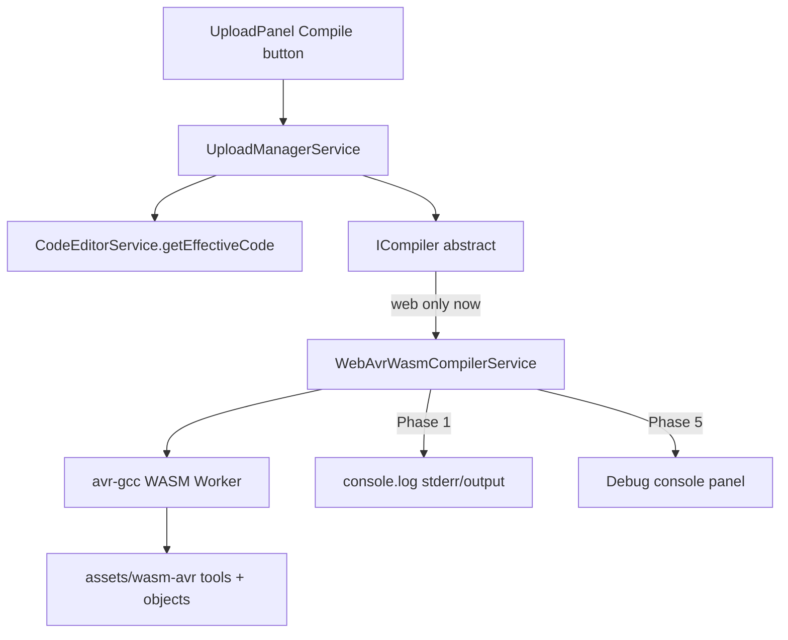

# План: компіляція AVR (web-first, WASM)

## Поточна ціль

**Зібрати робочу web-версію компіляції** для AVR (Uno / Nano, ATmega328P):

- in-browser WASM (`avr-gcc-wasm`)
- бібліотеки з [`compilation/arduino/userlibs`](compilation/arduino/userlibs) через asset pipeline
- кнопка **Compile** у header ([`upload-panel`](src/app/modules/upload/components/upload-panel/upload-panel.component.ts))
- **лог збірки в `console`** (на цьому етапі); UI debug console — наступна фаза

**Не в scope зараз:** upload, Electron hardening, remote server, ESP/Mega compile.

---

## Архітектура (адаптери — так, реалізація — лише web)

Код будуємо через існуючий контракт [`ICompiler`](src/app/core/interfaces/compiler.interface.ts), щоб пізніше додати інші платформи без переписування UI.



| Шар | Файл | Зараз | Пізніше |
|-----|------|-------|---------|
| UI trigger | `upload-panel.component.ts` | Compile → `compileOnly()` | debug panel |
| Orchestrator | `upload-manager.service.ts` | без змін | — |
| Contract | `ICompiler` | без змін | — |
| Web impl | `web-compiler.service.ts` → **`WebAvrWasmCompilerService`** | WASM AVR | — |
| Desktop impl | `electron-compiler.service.ts` | **не чіпати** | arduino-cli |
| Fallback | remote HTTP | **не робити** | Mega / ESP |

[`WebPlatformModule`](src/app/platform/web/web-platform.module.ts) продовжує `{ provide: ICompiler, useClass: … }` — лише замінюємо stub на WASM-реалізацію.

---

## Фаза 0 — spike WASM ✅ (видалено з репо)

Phase 0 підтвердив GO: WASM avr-gcc працює для 328p; бібліотеки ByByte — через prebuilt `.o` + headers.  
Перевірка зараз: `npm run prepare:wasm-avr -- verify all` ([`src/wasm-avr/README.md`](src/wasm-avr/README.md)).

---

## Фаза 1 — WASM compile з кнопки + лог у console ✅

**Мета:** натиснув Compile → у devtools видно повний лог; при успіху — HEX у пам’яті (поки без download UI).

### 1.1 `WebAvrWasmCompilerService`

Новий сервіс (або заміна [`WebCompilerService`](src/app/platform/web/services/web-compiler.service.ts)):

- використовує patched `firmware-builder.js` з `src/assets/wasm-avr/` ([`WebAvrWasmCompilerService`](src/app/platform/web/services/web-avr-wasm-compiler.service.ts))
- Worker через `@horang-corp/avr-gcc-wasm` або власний worker-обгортку
- `assetsBase` → `assets/wasm-avr/` (копія `tools/` + `assets/` з npm + bybyte objects)
- `compile(options)` → `CompileResult` з `hexContent`, `output` (= stderr gcc/ld), `flashBytes`, `fitsTarget`

### 1.2 Кнопка Compile

У [`upload-panel.component.ts`](src/app/modules/upload/components/upload-panel/upload-panel.component.ts):

- `onCompileOnly()` — перевіряти **лише плату** (port не потрібен)
- після `compileOnly()`:
  ```ts
  console.group('[Compile]');
  console.log(result.output);
  if (result.error) console.error(result.error);
  if (result.hexContent) console.log('HEX length:', result.hexContent.length, 'flash:', result.flashBytes);
  console.groupEnd();
  ```
- `alert()` на помилку — **прибрати** або лишити мінімальний toast; основний лог — console

### 1.3 `CompileResult` (розширення)

```ts
interface CompileResult {
  success: boolean;
  output: string;       // повний лог (stderr + timings)
  error?: string;
  hexContent?: string;  // web
  hexPath?: string;     // desktop (майбутнє)
  flashBytes?: number;
  fitsTarget?: boolean;
  fqbn?: string;
}
```

### 1.4 Обмеження FQBN (web)

| FQBN | Поведінка |
|------|-----------|
| `arduino:avr:uno`, `arduino:avr:nano` | compile |
| `arduino:avr:mega`, ESP, інші | зрозуміле повідомлення в console: «поки лише AVR 328p у web» |

### 1.5 Перевірка

- `npm run build:web`
- Blink-скетч з Blockly → Compile → console показує лог + HEX length
- Servo-скетч — те саме

---

## Фаза 2 — asset pipeline: бібліотеки у WASM ✅ (W1)

**Мета:** не unity-build, а **prebuilt `.o` + headers** для бібліотек ByByte (як Servo у npm-пакеті).

### 2.1 `src/wasm-avr/prepare-bybyte-assets.mjs`

Скрипт (CI / локально, Windows ок — WASM avr-gcc):

1. Бере `@horang-corp/avr-gcc-wasm` base assets
2. Додає headers з [`src/wasm-avr/libraries/`](src/wasm-avr/libraries/)
3. Компілює `.cpp` → `.o` WASM avr-gcc
4. Оновлює `manifest.json`: `objectGroups.bybyte`, `headerFiles`
5. Output → `src/assets/wasm-avr/` (tools + assets, ~55 MB+, gitignored)

`npm run prepare:wasm-avr` + документація в `src/wasm-avr/README.md`.

### 2.2 Хвилі бібліотек (пріоритет)

Не весь `userlibs` одразу (сотні lib, гігабайти). Хвилі за **реальним** `#include` / `registerInclude` у generators для toolbox **uno** / **nano** (не ESP/MRT-only блоки).

| Хвиля | Бібліотеки | Джерело блоків (generators) |
|-------|------------|-----------------------------|
| **W0** (npm) | Servo, Wire, SPI, DHT, VL53L0X, Firmata, Adafruit_GFX / SSD1306 / BMP085 / BusIO / Unified_Sensor | `definitions/servo`, `i2c`, `spi`, `dht`, `displays`, `firmata` |
| **W1** ✅ | EEPROM.h, `lib_eeprom_avr.o`, Otto, Oscillator, Otto_matrix | `definitions/otto`, `otto9`, `otto9_app`, `otto9_pro`, `otto9_eyes`, `otto9_sounds`, `otto9_gesture`, `otto9_inputs`, `otto9_outputs`, `otto9_sensors`, `otto9_ledmatrix`, `otto9_ultrasonic`, `otto9_buzzer`, `otto9_button`, `otto9_home`, `otto9_movements`, `otto9_mpu6050`, `otto9_servo`, `otto9_sounds`, `otto9_sensors` |
| **W2** ✅ | **SerialCommand**, **SoftwareSerial** (AVR core) | `otto9_app` (BT SerialCommand); `bluetooth`, `gps`, `softserial`, `audio.helper` (RedMP3 / DFPlayer soft UART) |
| **W3** ✅ | TM1637Display, LedControl, Adafruit_NeoPixel, LiquidCrystal_I2C, Adafruit_SH1106, Adafruit_ST7735 | `definitions/displays`, `definitions/led` |
| **W4** ✅ | Stepper, AFMotor | `definitions/motors` (dc, stepper; не MRT SoftPWM) |
| **W5** ✅ | RTClib, IRremote, BME280, I2Cdev + MPU6050, Adafruit_TCS34725, Adafruit_HMC5883_U, MFRC522, PN532 + NDEF headers, Encoder, Adafruit_APDS9960, Adafruit_PWMServoDriver, TinyGPSPlus, MuVisionSensor | `definitions/sensing`, `gps`, `muvision`, `remote` |
| **W6** ✅ | PlayRtttl, RedMP3, TEA5767N | `definitions/audio` |
| **W7** ✅ | Quad (+ Octosnake) | `platforms/otto/quad` |

**Поза WASM AVR (не uno/nano compile):** категорія IoT (ESP8266WiFi, PubSubClient, Firebase…), RemoteXY, Adafruit_LEDBackpack (ninja wifi app), Keyboard/Mouse/BLE, SoftPWM / EnableInterrupt (лише MRT), Adafruit_MCP23X08 (MRT X), espornabot — окремі платформи або remote compile.

**Примітки W2:** SerialCommand — зовнішня lib (немає в `userlibs`), додати в `src/wasm-avr/libraries/`. SoftwareSerial — частина Arduino AVR core; перевірити headers + link у WASM assets (не окремий `.o` з userlibs).

Критерій хвилі: `npm run prepare:wasm-avr -- verify wN` + unit/integration tests.

### 2.3 Відсутні headers / link fixes

Відомі з Phase 0 / verify:

- `EEPROM.h` — додати з Arduino AVR core у assets
- `eeprom_read_byte` — перевірити link order / avr-libc (не stub у production)
- include paths — `-I /libraries/Otto`, `-I /arduino/libraries/EEPROM/src`, …

### 2.4 Розмір і кеш

- assets **не** в JS bundle — static `assets/wasm-avr/`
- long-cache headers у prod; опційно IndexedDB preload (фаза 2b)

---

## Фаза 3 — `.ino` preprocess

Blockly генерує Arduino-sketch-подібний код. WASM очікує valid C++.

- Мінімальний `sketch-preprocessor.ts`: `setup`/`loop` + forward declarations для user functions
- Або: генератор Blockly одразу emit C++ з прототипами (краще довгостроково)
- Unit-тест: типовий workspace → preprocess → WASM compile без помилок cc1plus

---

## Фаза 4 — debug console у UI

**Після** стабільного console-log flow.

- Панель / drawer «Build log» (аналог legacy `#message`) у upload popover або окрема debug-зона
- Підписка на `UploadManagerService.progress$` + повний `CompileResult.output`
- Syntax highlight помилок gcc (опційно)
- Кнопка «Copy log» / «Download .hex»

Console.log залишити в dev mode (`environment.production === false`).

---

## Backlog (після web MVP)

| Задача | Коли |
|--------|------|
| Electron `arduino-cli` + `--libraries userlibs` | desktop release |
| Remote compile-server (Mega, ESP, Android) | коли WASM не покриває FQBN |
| Upload Web Serial / esp-web-tools | окремий план |
| GPL-3 Corresponding Source для WASM toolchain | перед public release |
| Mega (2560) WASM | unlikely; remote |

---

## Порядок робіт

1. ✅ Фаза 0 — spike
2. **Фаза 1** — WebAvrWasmCompilerService + Compile button + console log
3. **Фаза 2** — prepare-bybyte-assets + хвилі W1–W5 ✅, далі W6+
4. **Фаза 3** — ino preprocess
5. **Фаза 4** — UI debug console
6. Backlog — Electron / remote / upload

---

## Вирішено

- **Платформа:** лише **web** на даному етапі; код через **ICompiler** для майбутніх адаптерів
- **Движок:** WASM AVR (328p), не remote (поки)
- **Бібліотеки:** prebuilt assets з `userlibs`, хвилями
- **UI:** кнопка Compile; лог → **console** → потім debug UI
- **Upload:** не в цьому плані
- **Phase 0 spike:** GO з обмеженнями; код spike прибрано, verify W1–W7 замінює runner
- **W2–W7 каталог:** скан `#include` у generators для uno/nano — див. таблицю §2.2; **W2 = лише SerialCommand + SoftwareSerial**; решта розкладена по W3–W7

## Відкриті питання (не блокують фазу 1)

1. IndexedDB cache для ~55 MB assets — робити в фазі 2 чи 4?
2. Nano old/new bootloader — один FQBN на compile чи два профілі?
3. GPL-3 disclosure сторінка — до public beta чи release?
