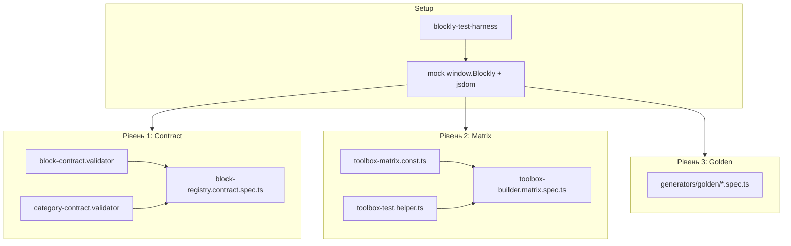

# План тестів Blockly (contract + matrix + golden)

## Поточний стан

- Тести існують лише для upload-модуля ([`upload-manager.service.spec.ts`](src/app/modules/upload/services/upload-manager.service.spec.ts)) — Jasmine + `TestBed`, але **немає** test target у [`angular.json`](angular.json) і **немає** `vitest`/`jest`/`karma` у [`package.json`](package.json).
- Blockly-логіка зосереджена в [`src/app/modules/blockly/`](src/app/modules/blockly/):
  - реєстрація: [`block-registry.ts`](src/app/modules/blockly/lib/registry/block-registry.ts) → `Blockly.Blocks` + `window.Blockly.Arduino.forBlock`
  - ініціалізація: [`initializeAllBlocks()`](src/app/modules/blockly/definitions/index.ts)
  - toolbox: [`ToolboxBuilder.forBoard()`](src/app/modules/blockly/lib/builders/toolbox-builder.ts)

## Архітектура тестів (3 рівні)



**Принцип:** не тестувати кожен блок окремо — перевіряти **інваріанти** для всіх блоків/категорій + **матрицю** board × level + **5–10 канарійок** для складної генерації.

---

## Крок 0: Інфраструктура тестів

### Runner: Vitest (рекомендовано)

Blockly contract/matrix тести не потребують Angular DI — Vitest швидший і простіший за повний Karma setup.

**Додати:**
- devDependencies: `vitest`, `jsdom`, `@vitest/coverage-v8` (опційно)
- [`vitest.config.ts`](vitest.config.ts) у корені:
  - `environment: 'jsdom'`
  - `include: ['src/app/modules/blockly/**/*.spec.ts']`
  - alias `@app` → `src/app` (як у [`tsconfig.json`](tsconfig.json))
- [`tsconfig.spec.json`](tsconfig.spec.json) — extends основного tsconfig, `"types": ["vitest/globals"]`
- npm script: `"test:blockly": "vitest run src/app/modules/blockly"` і `"test:blockly:watch": "vitest src/app/modules/blockly"`

**Angular component-тести** (upload) залишити на Jasmine; підключити `ng test` окремим етапом, якщо потрібно.

---

## Крок 1: Test harness

Створити [`src/app/modules/blockly/testing/blockly-test-harness.ts`](src/app/modules/blockly/testing/blockly-test-harness.ts):

```typescript
export function setupBlocklyTestEnv(): void {
  // 1. jsdom window (Vitest environment)
  // 2. window.Blockly = { Blocks: {}, Arduino: { forBlock: {} }, Python: { forBlock: {} } }
  // 3. BlockRegistry.clear(); BlockRegistry.clearCategories()
  // 4. initializeAllBlocks()
  // 5. initializeArduinoGenerator() — для golden-тестів
}

export function teardownBlocklyTestEnv(): void {
  BlockRegistry.clear();
  BlockRegistry.clearCategories();
}
```

**Важливо:** `BlockRegistry.register()` пише в `window.Blockly.Arduino.forBlock` — без mock harness contract-тести падають у Node.

---

## Крок 2: Contract-тести (Рівень 1)

### Файли

| Файл | Призначення |
|------|-------------|
| [`testing/block-contract.validator.ts`](src/app/modules/blockly/testing/block-contract.validator.ts) | Інваріанти блоків |
| [`testing/category-contract.validator.ts`](src/app/modules/blockly/testing/category-contract.validator.ts) | Інваріанти категорій |
| [`block-registry.contract.spec.ts`](src/app/modules/blockly/block-registry.contract.spec.ts) | Один spec, що проганяє validators по всьому реєстру |

### Інваріанти блоків (`validateAllBlocks`)

Для кожного `BlockRegistry.getAll()`:

1. **Унікальний `type`** — без дублікатів у Map
2. **`config.category` існує** — `BlockRegistry.getCategoryConfig(category)` !== undefined (крім `"Mutator"`, `"Shadow"`)
3. **`config.level`** — значення з `BlockLevelE` (0|1|2)
4. **`config.platforms` не порожній**
5. **Arduino generator** — якщо `platforms` містить `"arduino"`, то `window.Blockly.Arduino.forBlock[type]` — функція
6. **`init` callable** — `typeof block.init === 'function'`
7. **Board filters консистентні** — `boards` і `excludedBoards` не перетинаються
8. **Mutator blocks** — якщо `tags` містить `"hidden"`, категорія `"Mutator"` або `"Shadow"`

### Інваріанти категорій (`validateAllCategories`)

Для кожного `BlockRegistry.getCategories()`:

1. **`colour`** — число з [`CATEGORY_PALETTE`](src/app/modules/blockly/constants/category-palette.const.ts) (або дозволений hue 0–360)
2. **`parentCategory`** — якщо задано, батько існує в `categoriesMap`
3. **Немає циклів** parent → child
4. **Container categories** (`isContainer: true`) — мають хоча б одну дочірню категорію з `parentCategory === name`
5. **`hiddenBoardIds` / `requiredBoardIds`** — не конфліктують для однієї плати в matrix (перевірка на рівні matrix, не тут)

### Spec

```typescript
describe('BlockRegistry contract', () => {
  beforeAll(() => setupBlocklyTestEnv());
  afterAll(() => teardownBlocklyTestEnv());

  it('blocks satisfy invariants', () => {
    expect(validateAllBlocks()).toEqual([]); // [] = no violations
  });

  it('categories satisfy invariants', () => {
    expect(validateAllCategories()).toEqual([]);
  });
});
```

Validators повертають масив `{ code, message, context }[]` — зручно для CI-логів.

---

## Крок 3: Toolbox matrix (Рівень 2)

### Референсні плати × рівні

| boardId | Тип | Навіщо |
|---------|-----|--------|
| `uno` | AVR baseline | загальні категорії, обидва Robot-контейнери |
| `esp32` | WiFi/ESP32 | ESP-категорії, IoT |
| `esp8266` | WiFi/ESP8266 | ESP8266-специфіка |
| `OttoESP` | Otto exclusive | Otto Robot, без ByByte |
| `Ottoky` | Otto ESP32 | Otto + esp32 boardType |
| `bybyte_nano` | ByByte exclusive | ByByte Robot, без Otto |
| `mrtx` | MRT | MRT + Otto wheels subcat |

Рівні: `BlockLevelE.BEGINNER`, `INTERMEDIATE`, `ADVANCED`.

### Файли

| Файл | Призначення |
|------|-------------|
| [`testing/toolbox-matrix.const.ts`](src/app/modules/blockly/testing/toolbox-matrix.const.ts) | Матриця очікувань |
| [`testing/toolbox-test.helper.ts`](src/app/modules/blockly/testing/toolbox-test.helper.ts) | Обхід дерева toolbox, `collectCategoryNames()`, `collectBlockTypes()` |
| [`toolbox-builder.matrix.spec.ts`](src/app/modules/blockly/toolbox-builder.matrix.spec.ts) | Parametrized tests |

### Структура matrix entry

```typescript
interface ToolboxMatrixCase {
  boardId: string;
  userLevel: BlockLevelE;
  mustIncludeCategories: string[];   // "%{BKY_CAT_...}" keys
  mustExcludeCategories: string[];   // e.g. ByByte on OttoESP
  minBlockCount?: number;            // sanity: toolbox не порожній
  mustIncludeBlocks?: string[];      // опційно: ключові блоки
  mustExcludeBlocks?: string[];      // e.g. board-gated
}
```

### Приклади mustInclude / mustExclude (з platform packs)

- **`uno` + BEGINNER:** Logic, Ports, Motors; **обидва** `%{BKY_CAT_ROBOT_OTTO}` і `%{BKY_CAT_ROBOT_BYBYTE}` (див. [`otto/config.ts`](src/app/modules/blockly/platforms/otto/config.ts), [`bybyte/config.ts`](src/app/modules/blockly/platforms/bybyte/config.ts) — `hiddenBoardIds`)
- **`OttoESP`:** mustInclude Otto container; mustExclude `%{BKY_CAT_ROBOT_BYBYTE}`
- **`bybyte_nano`:** mustInclude ByByte; mustExclude Otto container
- **`esp32` + ADVANCED:** IoT/HTML категорії (якщо `minLevel <= ADVANCED`)
- **`uno` + BEGINNER:** категорії з `minLevel: INTERMEDIATE` **відсутні**

### Загальні інваріанти matrix (для кожного case)

1. `ToolboxBuilder.forBoard(boardId, { userLevel }).contents.length > 0`
2. Жодна non-custom категорія без блоків і без дочірніх (перевірка `_pruneEmptyCategories`)
3. Категорії `Mutator` / `Shadow` не з'являються в toolbox
4. Усі block types у toolbox зареєстровані в `BlockRegistry`
5. Custom categories (`Variables`, `Procedures`) — присутні з `custom: "VARIABLE"` / `"PROCEDURE"` без статичних блоків

### Parametrized spec

```typescript
describe.each(TOOLBOX_MATRIX)('$boardId @ level $userLevel', (case) => {
  it('includes expected categories', () => { /* ... */ });
  it('excludes gated categories', () => { /* ... */ });
  it('has no orphan toolbox blocks', () => { /* ... */ });
});
```

~21 кейс (7 плат × 3 рівні) — швидко, але покриває board gating, level gating, robot exclusivity.

---

## Крок 4: Golden generator tests (Рівень 3)

Мета: зловити регресії в **складних** блоках (mutator, switch, IoT HTML), не дублюючи contract-тести.

### Файли

```
src/app/modules/blockly/testing/generators/
  golden-workspace.factory.ts    # створення Blockly workspace + block instance
  golden/
    logic-if.golden.spec.ts
    text-join.golden.spec.ts
    otto-move.golden.spec.ts
    iot-html.golden.spec.ts
    controls-switch.golden.spec.ts  # якщо є
```

### Канарійки (5–10 блоків)

| Блок | Чому |
|------|------|
| `controls_if` | mutator (else/elseif branches) |
| `text_join` | dynamic input mutator |
| `procedures_defnoreturn` | dynamic procedures |
| Otto movement block (e.g. `otto9_move`) | platform pack + fields |
| IoT HTML block (з [`html.blocks.ts`](src/app/modules/blockly/definitions/iot/html/html.blocks.ts)) | складний generator + includes |
| `logic_switch` / arrays block | switch/array codegen |

### Підхід

1. Harness: `setupBlocklyTestEnv()` + `initializeArduinoGenerator()`
2. Factory: створити block у jsdom-workspace через `Blockly.Blocks[type].init.call(blockInstance)`
3. Встановити field values / mutator state (мінімальний XML або programmatic)
4. `generator.blockToCode(block)` → порівняти з `.golden.txt` snapshot

Vitest: `expect(code).toMatchSnapshot()` або явний string match для стабільності.

**Scope:** лише Arduino generator; Python — окремо, якщо з'явиться demand.

---

## Структура каталогів (підсумок)

```
src/app/modules/blockly/
  testing/
    blockly-test-harness.ts
    block-contract.validator.ts
    category-contract.validator.ts
    toolbox-matrix.const.ts
    toolbox-test.helper.ts
    generators/
      golden-workspace.factory.ts
      golden/
        *.golden.spec.ts
        __snapshots__/          # Vitest snapshots
  block-registry.contract.spec.ts
  toolbox-builder.matrix.spec.ts
```

---

## CI та локальний workflow

1. `npm run test:blockly` — перед PR, що торкається `src/app/modules/blockly/`
2. Опційно GitHub Actions / Bitbucket Pipeline step після `build:web`
3. При додаванні блоку/категорії:
   - contract-тести падають автоматично, якщо порушено інваріант
   - matrix — оновити [`toolbox-matrix.const.ts`](src/app/modules/blockly/testing/toolbox-matrix.const.ts) лише якщо змінилась board/level видимість
   - golden — оновити snapshot лише для зміненого generator

---

## Порядок імплементації

1. Vitest + jsdom + npm scripts
2. Harness + mock Blockly
3. Validators + contract spec (найбільший ROI)
4. Toolbox helper + matrix const + matrix spec
5. Golden factory + 5 канарійок
6. CI hook

## Очікуваний результат

- **~2 spec-файли + helpers** покривають **усі** блоки й категорії через інваріанти
- **~21 matrix case** покриває board/level/robot gating без ручного перебору
- **5–10 golden** ловлять регресії codegen для складних блоків
- Час прогону: орієнтовно < 30 с локально
