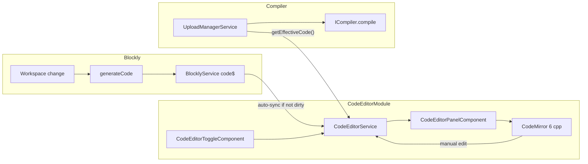

# План: модуль редактора згенерованого коду

## Контекст

**Legacy** ([www/js/blocklino.js](www/js/blocklino.js), [www/css/blocklino.css](www/css/blocklino.css)):
- Бічний overlay `#toggle` (~25% справа) з read-only preview через Prettify
- Окремий повноекранний Ace Editor для ручного редагування
- Компілятор бере `editor.getValue()` або preview залежно від режиму

**Поточний Angular**:
- Генерація: [blockly-editor.component.ts](src/app/modules/blockly/components/blockly-editor/blockly-editor.component.ts) → `Blockly.Arduino.workspaceToCode()` → `BlocklyService.updateCode()`
- Компіляція: [upload-manager.service.ts](src/app/modules/upload/services/upload-manager.service.ts) читає `BlocklyService.getCurrentCode()` напряму
- UI редактора коду **відсутній**; layout — header + fullscreen Blockly ([app.component.html](src/app/app.component.html))

**Рішення користувача:** CodeMirror 6.

---

## Цільова архітектура



**Ключовий патерн — Facade / Single Source of Truth:** `CodeEditorService` стає єдиним API для «коду, який піде в компілятор», замість прямого читання з `BlocklyService`.

---

## Структура модуля

```
src/app/modules/code-editor/
├── code-editor.module.ts
├── index.ts
├── interfaces/
│   └── code-source.interface.ts      # ICodeSource для DI / compiler
├── services/
│   └── code-editor.service.ts        # state, sync, effective code
├── constants/
│   └── editor-theme.config.ts        # light/dark CodeMirror themes
├── components/
│   ├── code-editor-panel/
│   │   ├── code-editor-panel.component.ts/html/scss
│   └── code-editor-toggle/
│       └── code-editor-toggle.component.ts
```

Іконки панелі: `assets/icons/header/copy.svg`, `assets/icons/header/close.svg` (copy — замінюваний placeholder).

За зразком [upload.module.ts](src/app/modules/upload/upload.module.ts): `declarations`, `exports` toggle + panel, `providedIn: 'root'` для сервісу.

---

## 1. Залежності

Додати в [package.json](package.json):

```json
"codemirror": "^6.x",
"@codemirror/view": "^6.x",
"@codemirror/state": "^6.x",
"@codemirror/lang-cpp": "^6.x",
"@codemirror/commands": "^6.x",
"@codemirror/language": "^6.x",
"@codemirror/theme-one-dark": "^6.x"
```

Arduino-підсвітка: **`@codemirror/lang-cpp`** (як у legacy `ace/mode/c_cpp`) — достатньо для `.ino` sketch.

---

## 2. CodeEditorService — ядро логіки

Файл: `services/code-editor.service.ts`

**State:**
- `isOpen$` — видимість панелі (persist у `localStorage`, ключ `code-panel-open`)
- `generatedCode$` — підписка на `BlocklyService.code$`
- `editedCode` — поточний текст у редакторі
- `isDirty` — чи користувач редагував вручну

**Правила синхронізації (one-way Blockly → editor, як у legacy):**
- Якщо `!isDirty` → при зміні `code$` оновлювати редактор
- Якщо `isDirty` → **не перезаписувати** редактор; показати badge «Edited manually» / «Відредаговано вручну»
- Метод `resetToGenerated()` — скинути dirty і підставити останній згенерований код

**API для компілятора:**
```typescript
interface ICodeSource {
  getEffectiveCode(): string;   // editedCode якщо dirty, інакше generated
  isManuallyEdited(): boolean;
  resetToGenerated(): void;
}
```

**Resize hook:** `panelOpenChange$` — для виклику `Blockly.svgResize()` у workspace. `ResizeObserver` на контейнері Blockly покриває зміну ширини під час drag.

**Angular zone:** UI-методи панелі (`setPanelOpen`, `setPanelWidth`) обгорнуті в `runInAngularZone()` — header/panel кліки й pointer-події unpatched у [zone-flags.ts](src/zone-flags.ts).

---

## 3. CodeEditorPanelComponent — права панель

**Layout** ([app.component.html](src/app/app.component.html)):

```html
<main class="app-main">
  <app-blockly-editor class="app-main__workspace"></app-blockly-editor>
  <app-code-editor-panel></app-code-editor-panel>
</main>
```

**Layout CSS** ([app.component.scss](src/app/app.component.scss)): `app-main` flex row; workspace `flex: 1; min-width: 0`.

**Panel CSS** ([code-editor-panel.component.scss](src/app/modules/code-editor/components/code-editor-panel/code-editor-panel.component.scss)):
- Host: `width: 0` (closed) → `var(--panel-width, 420px)` через клас `.code-editor-panel-host--open`
- Відкриття миттєве (`transition: none`), закриття ~150ms
- `pointer-events: none` коли панель закрита
- Drag resize: локальне оновлення `--panel-width` під час drag, persist у `commitResize()`
- Header: заголовок `var(--app-header-font-lg)`, іконки через SVG-mask (`copy.svg`, `close.svg`), компактний padding `0.375rem 0.75rem`

**Панель містить:**
- Mini-header: заголовок, Copy, закрити, «Reset to blocks» (якщо dirty)
- CodeMirror host `<div #editorHost>`
- Footer badge: dirty state

**CodeMirror lifecycle:**
- Ініціалізація в `ngAfterViewInit` через `EditorView` + `EditorState`
- Extensions: `cpp()`, `lineNumbers`, `history`, `highlightActiveLine`, theme extension
- `onChange` → `CodeEditorService.setEditedCode(value)` + `isDirty = true`
- `ngOnDestroy` → `view.destroy()`

**Теми** ([editor-theme.config.ts](src/app/modules/code-editor/constants/editor-theme.config.ts)):
- Підписка на `ThemeService.onResolvedThemeChange`
- `dark` → `oneDark`
- `light` → custom `EditorView.theme()` з CSS variables з [_themes.scss](src/styles/_themes.scss) (`--app-surface`, `--app-text`, `--app-border`)

Додати змінні в `_themes.scss`:
```scss
--code-editor-bg: var(--app-surface);
--code-editor-gutter-bg: ...;
```

---

## 4. CodeEditorToggleComponent — кнопка в header

Розмістити в [app-header.component.html](src/app/shared/components/header/app-header/app-header.component.html) перед `<app-theme-toggle>`:

```html
<app-code-editor-toggle></app-code-editor-toggle>
```

- Іконка: новий SVG `assets/icons/header/code.svg` (стиль як [upload.svg](src/assets/icons/header/upload.svg))
- `[class.header-icon-btn--active]` коли панель відкрита
- `(click)` → `CodeEditorService.togglePanel()`
- i18n: `ui.btn_code_panel`, `ui.code_panel_title`, `ui.code_edited_manually`, `ui.code_reset_to_blocks`

Оновити [en.json](src/assets/i18n/en.json) та [uk.json](src/assets/i18n/uk.json).

---

## 5. Інтеграція з Blockly resize

У [blockly-editor.component.ts](src/app/modules/blockly/components/blockly-editor/blockly-editor.component.ts):
- Inject `CodeEditorService`
- Підписатися на `panelOpenChange$` → `setTimeout(() => Blockly.svgResize(this.workspace))`

Альтернатива (чистіше): `@Output()` з panel через app component — але сервісний event простіший і відповідає патерну UploadManager.

---

## 6. Підготовка до компілятора

**Фаза 1 (цей PR):** реалізувати `ICodeSource` + `getEffectiveCode()`, але **не змінювати** `UploadManagerService` — лише додати unit-тести, що effective code коректний.

**Фаза 2 (наступний крок, 1 рядок зміни):** у [upload-manager.service.ts](src/app/modules/upload/services/upload-manager.service.ts):

```typescript
// було:
const code = this.blocklyService.getCurrentCode();
// стане:
const code = this.codeEditorService.getEffectiveCode();
```

Це забезпечить parity з legacy: компіляція відредагованого коду.

---

## 7. Підключення модуля

| Файл | Зміна |
|------|-------|
| [shared.module.ts](src/app/shared/shared.module.ts) | `import { CodeEditorModule }` |
| [header.module.ts](src/app/shared/components/header/header.module.ts) | `import { CodeEditorModule }` для toggle у header |
| [app.component.html](src/app/app.component.html) | додати `<app-code-editor-panel>` |
| [styles.scss](src/app/styles.scss) | стилі для `.cm-editor` (font, height 100%) |

---

## 8. Тести

Vitest (як [upload-manager.service.spec.ts](src/app/modules/upload/services/upload-manager.service.spec.ts)):

`code-editor.service.spec.ts`:
- auto-sync при `!isDirty`
- no overwrite при `isDirty`
- `getEffectiveCode()` повертає edited vs generated
- `resetToGenerated()` скидає dirty
- `togglePanel()` / localStorage persistence

---

## Відмінності від legacy (свідомі)

| Legacy | Нова реалізація |
|--------|-----------------|
| Read-only side preview + окремий fullscreen Ace | Одна editable панель справа |
| Bootstrap slide toggle | CSS width transition |
| Ace `c_cpp` | CodeMirror `lang-cpp` |
| `localStorage.content` blocks/code mode | Панель не замінює workspace |
| Fixed Ace theme | Sync з `ThemeService` |

---

## Порядок імплементації

1. Scaffold `CodeEditorModule` + `CodeEditorService` + interface ✅
2. Встановити CodeMirror 6 deps ✅
3. `CodeEditorPanelComponent` з темами та cpp mode ✅
4. Layout у `app.component` + resize hook ✅
5. `CodeEditorToggleComponent` у header + i18n + icon ✅
6. Unit tests для sync logic ✅
7. `npm run build:web` — перевірка bundle size ✅

---

## Виконано після базової імплементації

### Виправлення багів

| Проблема | Причина | Рішення |
|----------|---------|---------|
| Панель не з’являлась у flex-row | `width: 100%` на Blockly обрізав панель | Flex layout, `min-width: 0` на workspace |
| Кнопка toggle не оновлювала UI | `click` unpatched у zone-flags | `NgZone.run()` у `CodeEditorService.setPanelOpen/setPanelWidth` |
| Resize «зависав» | pointer capture без cleanup | `abortResize()` / `commitResize()`, `body.code-editor-panel-resizing` |
| Панель ламалась після кількох toggle | inline styles + transitions | Host binding `--open` + `--panel-width`, спрощений cleanup |
| Затримка відкриття | CSS transition 250ms | Миттєве відкриття, закриття 150ms |

### Прибирання коду

- Видалено мертвий `layoutChange$` / `notifyLayoutChange()` (Blockly слухає `panelOpenChange$` + `ResizeObserver`)
- Прибрано зайві `detectChanges()` / подвійний `NgZone.run()` у toggle/panel
- Resize: ширина локально під час drag, запис у сервіс лише в `commitResize()`
- Toggle спрощено до підписки на `isOpen$` + `togglePanel()`

### UI polish (header панелі)

- Заголовок «Generated code» / «Згенерований код»: `var(--app-header-font-lg)`
- Іконки Copy / Close: SVG-mask як у header (`copy.svg`, `close.svg`), 28px / 32px
- Компактна смуга: padding `0.375rem 0.75rem`, кнопки 44–48px

### Залишилось (фаза 2)

- [upload-manager.service.ts](src/app/modules/upload/services/upload-manager.service.ts): замінити `getCurrentCode()` на `codeEditorService.getEffectiveCode()`
- За потреби — замінити placeholder `assets/icons/header/copy.svg` на фінальну іконку
