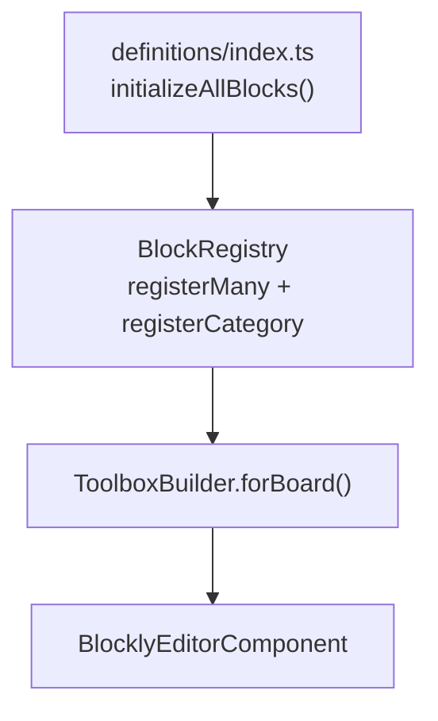
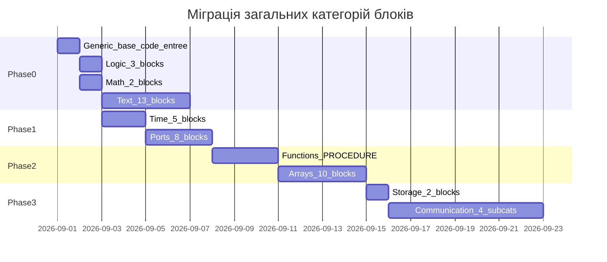

# План міграції загальних категорій блоків

## Контекст

**Ціль:** переписати legacy-блоки з [`www/blocs&generateurs/`](www/blocs&generateurs/) на Angular згідно з архітектурою проєкту ([`ARCHITECTURE.md`](ARCHITECTURE.md), [`TOOLBOX_ARCHITECTURE.md`](TOOLBOX_ARCHITECTURE.md)).

**Загальні категорії** — 11 груп програмування, не прив'язаних до конкретного залізa (на відміну від Otto, Sensors, IoT тощо). Нові ID категорій уже підготовлені в [`src/app/modules/language/translations/en.ts`](src/app/modules/language/translations/en.ts) та іконках [`src/app/modules/blockly/constants/category-icons.const.ts`](src/app/modules/blockly/constants/category-icons.const.ts).

---

## Цільова архітектура



**Патерн однієї категорії:**

```
src/app/modules/blockly/definitions/<name>/
├── config.ts      → CATEGORY_NAME, COLOR, ORDER, PLATFORMS
├── *.block.ts     → BlockBuilder + Arduino generator
└── index.ts       → initialize() → registerMany + registerCategory
```

**Підключення:** додати модуль у [`src/app/modules/blockly/definitions/index.ts`](src/app/modules/blockly/definitions/index.ts).

**Mutators:** через [`MutatorRegistry`](docs/MUTATOR_REGISTRY.md) (зразок: `definitions/logic/`).

**Legacy toolbox-референс:** [`www/toolbox/toolbox_arduino_all.xml`](www/toolbox/toolbox_arduino_all.xml).

---

## Карта категорій: legacy → Angular

| # | Legacy ID | Angular ID | Order | Статус | Прогрес |
|---|-----------|------------|-------|--------|---------|
| 1 | `CAT_ARDUINO` | `CAT_GENERIC` | 0 | Реалізовано | 5/6 блоків |
| 2 | `CAT_ARDUINO_TIME` | `CAT_TIME` | 1 | Не почато | 0/5 |
| 3 | `CAT_ARDUINO_IN` | `CAT_PORTS` | 2 | Не почато | 0/8 |
| 4 | `CAT_LOGIC` | `CAT_LOGIC` | 4 | Частково | 7/10 |
| 5 | `CAT_MATH` | `CAT_MATH` | 5 | Майже готово | 17/19 |
| 6 | `CAT_TEXT` | `CAT_TEXT` | 6 | Частково | 2/15 |
| 7 | `CAT_FUNCTIONS` | `CAT_FUNCTIONS` | 7 | Не почато | custom flyout |
| 8 | `CAT_VARIABLES` | `CAT_VARIABLES` | 8 | Реалізовано | 4/4 |
| 9 | `CAT_TAB` | `CAT_ARRAYS` | 9 | Не почато | 0/10 |
| 10 | `CAT_com` | `CAT_COMMUNICATION` | 10 | Не почато | 0/4 підкат. |
| 11 | `CAT_STOCKAGE` | `CAT_STORAGE` | 11 | Не почато | 0/2 |

**Загальний прогрес: ~5 з 11 категорій, ~38 з ~91 блоків (~42%).**

---

## Фаза 0 — Завершити вже початі категорії

### 1. Generic — [`definitions/generic/`](src/app/modules/blockly/definitions/generic/)

| Блок legacy | Angular | Статус |
|-------------|---------|--------|
| `base_setup_loop` | ✅ | Готово |
| `base_setup` | ✅ | Готово |
| `base_loop` | ✅ | Готово |
| `base_define` | ✅ | Готово |
| `base_code` | ✅ | Готово |
| `base_code_entree` | ❌ | Відсутній |

**Завдання:** додати `code-input.block.ts` з legacy [`arduino_blocs.js`](www/blocs&generateurs/arduino_blocs.js).

### 2. Logic — [`definitions/logic/`](src/app/modules/blockly/definitions/logic/)

| Блок legacy | Angular | Статус |
|-------------|---------|--------|
| `controls_if` | ✅ (+ mutator) | Готово |
| `controls_repeat_ext` | ✅ | Готово |
| `controls_whileUntil` | ❌ | Відсутній |
| `controls_for` | ✅ | Готово |
| `controls_switch` | ✅ (+ mutator) | Готово |
| `controls_flow_statements` | ✅ | Готово |
| `logic_operation` | ✅ | Готово |
| `logic_negate` | ❌ | Відсутній |
| `logic_null` | ❌ | Відсутній |
| `logic_boolean` | ✅ | Додано (замість null у legacy) |

**Завдання:** `while-until.block.ts`, `negate.block.ts`, `null.block.ts`.

### 3. Math — [`definitions/math/`](src/app/modules/blockly/definitions/math/)

| Блок legacy | Angular | Статус |
|-------------|---------|--------|
| `math_number` … `math_constant`, `math_trig` | ✅ | Готово |
| `logic_compare` | ✅ | |
| `intervalle` | ✅ `logic_compare_range` | Перейменовано |
| `math_modulo` | ❌ | Відсутній |
| `math_number_property` | ❌ | Відсутній |
| `conversion_tobyte/.../tofloat` | ✅ `cast_*` | |

**Завдання:** `modulo.block.ts`, `number-property.block.ts`.

### 4. Text — [`definitions/text/`](src/app/modules/blockly/definitions/text/)

Реалізовано: `text`, `text_charAt`. Відсутні ~13 блоків:
- `conversion_tochar`, `conversion_toString`, `conversion_toString2`
- `text_join`, `text_length`, `text_isEmpty`, `text_append`
- `text_indexOf`, `text_getSubstring`, `text_changeCase`, `text_trim`

**Legacy ref:** [`blockly_blocs.js`](www/blocs&generateurs/blockly_blocs.js), [`text.js`](www/blocs&generateurs/text.js).

### 5. Variables — [`definitions/variables/`](src/app/modules/blockly/definitions/variables/)

Повністю реалізовано (4/4). Завдання: перевірка Arduino-генератора.

---

## Фаза 1 — Нові базові категорії (високий пріоритет)

### 6. Time → `definitions/time/`

**Legacy:** `CAT_ARDUINO_TIME` → [`arduino_blocs.js`](www/blocs&generateurs/arduino_blocs.js)

| Блок | Опис |
|------|------|
| `base_delay` | delay() |
| `tempo_sans_delay` | Non-blocking delay |
| `millis_start` | Старт таймера |
| `millis` | Читання millis() |
| `inout_pulsein` | pulseIn() |

```
definitions/time/
├── config.ts          → CAT_TIME, order: 1, colour: 180
├── delay.block.ts
├── delay-nonblocking.block.ts
├── millis-start.block.ts
├── millis.block.ts
├── pulse-in.block.ts
└── index.ts
```

**Оцінка:** 1–2 дні.

### 7. Ports (I/O) → `definitions/ports/`

**Legacy:** `CAT_ARDUINO_IN` → [`arduino_blocs.js`](www/blocs&generateurs/arduino_blocs.js)

| Блок | Опис |
|------|------|
| `inout_digital_write/read` | Digital I/O |
| `inout_analog_write/read` | Analog I/O |
| `toggle` | Toggle pin |
| `inout_attachInterrupt/detachInterrupt` | Interrupts |
| `mrtduino_pin` | MRT-специфічний (metadata: board) |

```
definitions/ports/
├── config.ts          → CAT_PORTS, order: 2
├── digital-write.block.ts
├── digital-read.block.ts
├── analog-write.block.ts
├── analog-read.block.ts
├── toggle.block.ts
├── attach-interrupt.block.ts
├── detach-interrupt.block.ts
├── mrtduino-pin.block.ts   → requiredBoardTypes: ['mrt']
└── index.ts
```

**Оцінка:** 2–3 дні. Потрібен shadow-блок `inout_onoff` для digital write.

---

## Фаза 2 — Структури даних і функції

### 8. Functions → `definitions/functions/`

**Legacy:** `custom="PROCEDURE"` — динамічна категорія Blockly.

**Завдання:**
- Підключити `Blockly.Procedures` flyout у [`ToolboxBuilder`](src/app/modules/blockly/lib/builders/toolbox-builder.ts)
- Категорія з `custom: 'PROCEDURE'` (аналог Variables з `custom: 'VARIABLE'`)
- Перевірити Arduino-генератор для procedures
- Legacy ref: [`blockly_blocs.js`](www/blocs&generateurs/blockly_blocs.js), [`blocklino.js`](www/js/blocklino.js)

**Оцінка:** 2–3 дні.

### 9. Arrays → `definitions/arrays/`

**Legacy:** `CAT_TAB` → [`blockly_blocs.js`](www/blocs&generateurs/blockly_blocs.js)

| Блок | Тип |
|------|-----|
| `creer_tableau`, `array_create_with` | Створення |
| `fixer_tableau`, `array_getIndex`, `array_getsize` | Arduino-масиви |
| `list_create/set/get/append/size` | C++ vector/list |

Зберегти обидва підходи (C-масив vs list), як у legacy.

**Оцінка:** 3–4 дні.

---

## Фаза 3 — Комунікація та сховище

### 10. Communication → `definitions/communication/` (контейнер)

**Legacy:** `CAT_com` з 4 підкатегоріями:

| Підкатегорія | Angular ID | Legacy JS | Блоків |
|--------------|------------|-----------|--------|
| Serial USB | `CAT_COMMUNICATION_SERIAL` | `arduino_blocs.js`, `SerialUSB.js` | ~8 |
| Soft Serial | `CAT_COMMUNICATION_SOFTSERIAL` | `SoftwareSerial.js` | ~8 |
| Bluetooth | `CAT_COMMUNICATION_BLUETOOTH` | `softBT.js` | ~8 |
| Remote IR | `CAT_COMMUNICATION_REMOTE` | `remoteControl.js` | ~4 |

```
definitions/communication/
├── config.ts
├── serial/
├── soft-serial/
├── bluetooth/
├── remote/
└── index.ts
```

**Оцінка:** 5–7 днів. Потрібна підтримка вкладених категорій у ToolboxBuilder.

### 11. Storage → `definitions/storage/`

**Legacy:** `CAT_STOCKAGE` → [`arduino_blocs.js`](www/blocs&generateurs/arduino_blocs.js)

| Блок | Опис |
|------|------|
| `eeprom_read` | Читання EEPROM |
| `eeprom_write` | Запис EEPROM |

**Оцінка:** 0.5–1 день.

---

## Рекомендований порядок робіт



**Пріоритет старту:** Фаза 0 (Logic/Math) паралельно з Time + Ports — без них базове Arduino-програмування неможливе.

---

## Чеклист для кожної нової категорії

1. Створити `definitions/<name>/config.ts` з `CATEGORY_NAME`, `CATEGORY_COLOR`, `CATEGORY_ORDER`
2. Перенести блоки з legacy JS → `*.block.ts` через `BlockBuilder`
3. Mutators — через `MutatorRegistry` ([`docs/MUTATOR_REGISTRY.md`](docs/MUTATOR_REGISTRY.md))
4. Arduino generator — з [`arduino_generateurs_cpp.js`](www/blocs&generateurs/arduino_generateurs_cpp.js) / [`blockly_generateurs_cpp.js`](www/blocs&generateurs/blockly_generateurs_cpp.js)
5. Реєстрація — `index.ts` → `registerMany()` + `registerCategory()`
6. Підключення — додати в [`definitions/index.ts`](src/app/modules/blockly/definitions/index.ts)
7. i18n — ключі `CAT_*` уже в `en.ts` / `uk.ts`
8. Іконки — уже в [`category-icons.const.ts`](src/app/modules/blockly/constants/category-icons.const.ts)
9. Metadata — `.setMetadata({ requiredBoardTypes, minLevel })` для board-specific блоків
10. Тест — блок у toolbox, генерація C++ коду, порівняння з legacy output

---

## Технічні нотатки

**Що вже працює:**
- Патерн `BlockBuilder` + `BlockRegistry` перевірений на 5 категоріях
- Mutators для `controls_if` і `controls_switch` — зразок для складних блоків
- ToolboxBuilder автоматично групує блоки за category

**Інфраструктура, що потребує доробки:**
- **Вкладені категорії** в ToolboxBuilder — для Communication
- **Custom flyout** — `VARIABLE` (частково) і `PROCEDURE` (Functions)
- **Shadow blocks** — `inout_onoff`, `math_number` як shadow для I/O
- `ToolboxBuilder.buildStandardCategories()` — не використовується; вирішити: підключити або видалити

**Legacy-файли для референсу:**

| Категорія | Legacy JS |
|-----------|-----------|
| Generic, Time, Ports, Storage | `arduino_blocs.js` |
| Logic, Math, Text, Arrays | `blockly_blocs.js`, `text.js` |
| Communication Serial | `SerialUSB.js` |
| Communication SoftSerial | `SoftwareSerial.js` |
| Communication Bluetooth | `softBT.js` |
| Communication Remote | `remoteControl.js` |

---

## Оцінка термінів

| Фаза | Категорії | Блоків | Термін |
|------|-----------|--------|--------|
| 0 — Доробити | Generic, Logic, Math, Text | ~18 | ~1 тиждень |
| 1 — Базові | Time, Ports | ~13 | ~1 тиждень |
| 2 — Структури | Functions, Arrays | ~10 + flyout | ~1.5 тижні |
| 3 — Комунікація | Storage, Communication | ~30 | ~1.5 тижні |
| **Разом** | **11 категорій** | **~91 блок** | **~5 тижнів** |
