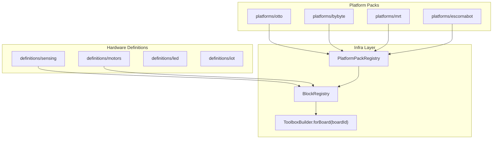
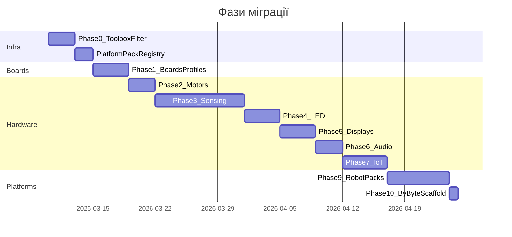

# План міграції hardware-блоків і плат

## Контекст

**Завершено:** 11 загальних категорій (~100 блоків) у [`src/app/modules/blockly/definitions/`](src/app/modules/blockly/definitions/) — див. [general_block_categories plan](.cursor/plans/general_block_categories_1d26dd3c.plan.md).

**Залишилось:** ~60 hardware-категорій у 55 legacy JS-файлах [`www/blocs&generateurs/`](www/blocs&generateurs/), 8 toolbox XML у [`www/toolbox/`](www/toolbox/), 22 профілі плат у [`www/js/boards.js`](www/js/boards.js).

**Angular зараз:** 7 плат у [`device-boards.const.ts`](src/app/modules/device/constants/device-boards.const.ts), 8 pin-профілів у [`device-profiles.const.ts`](src/app/modules/device/constants/device-profiles.const.ts). Robot-плати (OttoESP, Ottoky, MRTnode, uno_mrtx) **відсутні**.

**Обраний пріоритет плат:** Arduino + ESP + robot-плати (без micro:bit/pyBoard на цьому етаpi).

---

## Проблеми поточної інфраструктури (виправити до міграції блоків)

| Прогалина | Наслідок |
|-----------|----------|
| `ToolboxBuilder.forBoard(boardId)` визначає лише `boardType`, не передає `boardId` | Блоки з `.setBoards(['Ottoky'])` показуються на всіх ESP32 |
| `BlockRegistry.getFiltered({ board })` існує, але **не використовується** в ToolboxBuilder | Фільтрація по конкретній платі не працює |
| `IToolboxCategoryConfig` має `requiredBoardTypes`, але категорії **не фільтруються** | Robot-секція Otto видна на Uno |
| `excludeCategories` в `ToolboxOptions` не застосовується | Мертвий API |

Це критично для robot/platform-блоків — без виправлення архітектура Platform Pack не матиме ефекту.

---

## Цільова архітектура: Platform Pack Pattern

Ввести **Platform Pack** — самодостатній модуль, який реєструє все для однієї «платформи» (робот, освітній набір, кастомна плата):



### Нові файли (infra)

```
src/app/modules/blockly/
├── platforms/
│   ├── platform-pack.types.ts      # IPlatformPack interface
│   ├── platform-pack.registry.ts   # register / initializeAll
│   ├── otto/
│   │   ├── otto.pack.ts            # boards + categories + blocks init
│   │   ├── config.ts
│   │   ├── biped/                  # ottoesp.js blocks
│   │   ├── arms/                   # otto.js arms
│   │   ├── quad/                   # otto.js quad
│   │   └── ninja/                  # otto.js ninja
│   ├── bybyte/
│   │   └── bybyte.pack.ts          # placeholder для власних роботів
│   ├── mrt/
│   │   └── mrt.pack.ts             # MRTnode, uno_mrtx
│   └── escornabot/
│       └── escornabot.pack.ts
```

### Контракт `IPlatformPack`

```typescript
interface IPlatformPack {
  readonly id: string;                    // 'otto' | 'bybyte' | 'mrt' | ...
  readonly supportedBoardIds: string[];   // ['OttoESP', 'Ottoky']
  registerBoards(): IBoard[];             // → device BOARDS
  registerProfiles(): IBoardProfile[];     // → device BOARD_PROFILES
  initializeBlocks(): void;              // → BlockRegistry.registerMany
  initializeCategories(): void;          // → BlockRegistry.registerCategory
}
```

**Ініціалізація** у [`definitions/index.ts`](src/app/modules/blockly/definitions/index.ts):

```typescript
export function initializeAllBlocks(): void {
  BlockRegistry.initializeMutators();
  // 1. Загальні + hardware definitions
  [generic, time, ports, ...].forEach(m => m.initialize());
  // 2. Platform packs (robot + custom platforms)
  PlatformPackRegistry.initializeAll();
  BlockRegistry.setInitialized();
}
```

### Категорія Robot (контейнер)

Нова секція **`CAT_ROBOT`** («🤖 Робот») — аналог legacy `CAT_OTTO`, але розширювана:

| Підкатегорія | Platform Pack | Плати | Legacy JS |
|--------------|---------------|-------|-----------|
| `CAT_ROBOT_OTTO_BIPED` | otto | OttoESP, Ottoky | `ottoesp.js` |
| `CAT_ROBOT_OTTO_ARMS` | otto | OttoESP | `otto.js` |
| `CAT_ROBOT_OTTO_QUAD` | otto | OttoESP | `otto.js` |
| `CAT_ROBOT_OTTO_NINJA` | otto | OttoESP | `otto.js` |
| `CAT_ROBOT_ESCORNABOT` | escornabot | OttoESP | `escornabot.js` |
| `CAT_BYBYTE` | bybyte | bybyte_nano, bybyte_mega | *(нові блоки пізніше)* |

Кожна підкатегорія реєструється з:

```typescript
BlockRegistry.registerCategory(CAT_ROBOT_OTTO_BIPED, {
  parentCategory: CAT_ROBOT,
  requiredBoardIds: ['OttoESP', 'Ottoky'],  // NEW field
  subOrder: 0,
});
```

Блоки всередині pack:

```typescript
new BlockBuilder('otto_move')  // зберегти legacy type ID для сумісності XML
  .setBoards(['OttoESP', 'Ottoky'])
  .setCategory(CAT_ROBOT_OTTO_BIPED)
```

**ByByte pack** на цьому етаpi — порожній scaffold (категорія + pack), блоки додаються після міграції legacy.

---

## Оновлення ToolboxBuilder (Phase 0)

Файл: [`toolbox-builder.ts`](src/app/modules/blockly/lib/builders/toolbox-builder.ts)

1. `forBoard(boardId)` — зберігати `boardId` в `ToolboxOptions`
2. Фільтрація блоків через `BlockRegistry.getFiltered({ board: boardId, ... })`
3. Фільтрація категорій: `requiredBoardIds` + існуючий `requiredBoardTypes`
4. Приховувати порожні контейнери (якщо жодна підкатегорія не має блоків для поточної плати)
5. Розширити `IToolboxCategoryConfig` полем `requiredBoardIds?: string[]`

Файл: [`toolbox.types.ts`](src/app/modules/blockly/types/toolbox.types.ts) — додати `boardId?: string` до `ToolboxOptions`.

---

## Phase 1: Міграція плат (Arduino + ESP + Robot)

Джерело: [`www/js/boards.js`](www/js/boards.js) → Angular device module.

### 1.1 Розширити BOARDS

Файл: [`device-boards.const.ts`](src/app/modules/device/constants/device-boards.const.ts)

| ID | FQBN / core | Pack |
|----|-------------|------|
| `nanooptiboot`, `leonardo`, `micro`, `pro8`, `pro16`, `mini`, `yun`, `uno_bt`, `wemosD1miniPro`, `mkrwifi1010` | з legacy | — |
| `OttoESP` | esp8266:esp8266:nodemcuv2 | otto |
| `Ottoky` | esp32:esp32:esp32 | otto |
| `MRTnode` | esp32 (custom) | mrt |
| `uno_mrtx` | arduino:avr (atmega328p-x) | mrt |

Платформи ByByte (`bybyte_nano`, `bybyte_mega`) — залишити, додати pin-профілі.

### 1.2 Розширити BOARD_PROFILES

Файл: [`device-profiles.const.ts`](src/app/modules/device/constants/device-profiles.const.ts)

Перенести pin dropdowns для robot-плат (Ottoky named I/O: IN1, OUT1, CAP1…; MRTnode touch pins; uno_mrtx MCP pins) з legacy `boards.js`.

### 1.3 Platform Pack → Device integration

Кожен pack експортує boards/profiles; [`device-board-globals.helper.ts`](src/app/modules/device/helpers/device-board-globals.helper.ts) автоматично підхоплює через існуючий `exportLegacyProfileGlobal()`.

### 1.4 Оновити detectBoardType

Розширити [`toolbox-builder.ts`](src/app/modules/blockly/lib/builders/toolbox-builder.ts) + додати `BoardType` `'mrt'` для uno_mrtx / MRTnode-специфічних блоків.

---

## Phase 2–7: Hardware-категорії (definitions/)

Патерн — як у [`communication/`](src/app/modules/blockly/definitions/communication/): `config.ts` + `*.block.ts` + `index.ts` + nested subcategories.

### Phase 2: Motors (~15 блоків)

Папка: `definitions/motors/`

| Підкатегорія | Legacy JS | Блоки |
|--------------|-----------|-------|
| `CAT_MOTORS_SERVO` | `motor.js` | servo attach/write/read |
| `CAT_MOTORS_STEPPER` | `motor.js` | stepper init/step |
| *(legacy `CAT_actionneur`, `CAT_OTTO_WHEELS`)* | `motor.js` | → `platforms/otto/wheels/` |

### Phase 3: Sensing (~40+ блоків, найбільша фаза)

Папка: `definitions/sensing/` з 16 підкатегоріями (ключі вже в [`uk.ts`](src/app/modules/language/translations/uk.ts)).

Legacy файли: `sensors.js`, `TCS34725.js`, `APDS9960.js`, `gyro.js`, `HMC5883.js`, `GPS.js`, `RTC_DS3231.js`, `InternalRTC.js`, `RFID.js`, `analogkey.js`.

**Стратегія:** розбити на 4 підфази:
- 3a: Distance, Sound, Temperature, Light (4 підкат.)
- 3b: Gesture, Color, Magnet, Vibration, Humidity (5)
- 3c: Gas, Pressure, RTC, RFID (4)
- 3d: Compass, Gyro, GPS + buttons/knob/joystick (3+4)

ESP-only сенсори: `.setBoards()` або `metadata.requiredBoardTypes: ['esp32','esp8266']`.

### Phase 4: LED (~20 блоків)

Папка: `definitions/led/` — `leds.js`, `neopixel.js`, `matrix.js`, `MAX7219.js`.

### Phase 5: Displays (~15 блоків)

Папка: `definitions/displays/` — `oled.js`, `ST7735.js`, `Lcd_I2C.js`, `DisplayTM1637.js`.

### Phase 6: Audio (~12 блоків)

Папка: `definitions/audio/` — `audio.js`, `RTTTL.js`, `OpenSmartMP3.js`, `MP3YX5300.js`, `RadioTEA5767.js`.

### Phase 7: IoT (~25 блоків, ESP-only)

Папка: `definitions/iot/` — контейнер `CAT_IOT` з 9 підкатегоріями.

Legacy: `WifiBasic.js`, `ESPFunctions.js`, `WifiServer.js`, `MQTT.js`, `IFTTT.js`, `NTP.js`, `OpenWeather.js`, `Thingspeak.js`, `Telegram.js`, `Firebase.js`, `EspNow.js`, `Alexa.js`, `html.js`.

Категорія: `requiredBoardTypes: ['esp32', 'esp8266']`.

### Phase 8: Communication (доповнення)

Залишкові legacy-блоки: `Keyboard_and_mouse.js`, `mu_vision_sensor.js` → `definitions/communication/`.

---

## Phase 9: Robot Platform Packs

### 9.1 Otto Pack

Legacy → Angular (зберегти block type IDs):

| Legacy file | Блоків (≈) | Target |
|-------------|------------|--------|
| `ottoesp.js` | ~15 | `platforms/otto/biped/` |
| `otto.js` (arms) | ~5 | `platforms/otto/arms/` |
| `otto.js` (quad) | ~8 | `platforms/otto/quad/` |
| `otto.js` (ninja) | ~10 | `platforms/otto/ninja/` |

Генератори: `#include <Otto.h>`, `setups_`, `definitions_` — перенести з legacy generators.

### 9.2 Escornabot Pack

`escornabot.js` (~18 блоків) → `platforms/escornabot/`.

### 9.3 MRT Pack

MRT-специфічні блоки (якщо є окремо від ports/mrtduino-pin) + board profiles.

---

## Phase 10: ByByte Platform (scaffold)

На цьому етаpi — **лише інфраструктура**, без блоків:

- `platforms/bybyte/bybyte.pack.ts` — реєстрація `CAT_BYBYTE` під `CAT_ROBOT`
- Boards: `bybyte_nano`, `bybyte_mega` + pin profiles
- Placeholder для майбутніх блоків і функцій проєкту

Після міграції legacy — додавання нових блоків = новий файл у `platforms/bybyte/` + `.setBoards(['bybyte_nano'])`.

---

## i18n та іконки

Для кожної нової категорії:

1. Ключі блоків — перенести з [`www/lang/Arduino_en.js`](www/lang/Arduino_en.js) → [`en.ts`](src/app/modules/language/translations/en.ts) + [`uk.ts`](src/app/modules/language/translations/uk.ts)
2. Нові ключі Robot: `CAT_ROBOT`, `CAT_ROBOT_OTTO_*`, `CAT_ROBOT_ESCORNABOT` → [`category-icons.const.ts`](src/app/modules/blockly/constants/category-icons.const.ts)
3. `CAT_BYBYTE` вже є (іконка `robot`) — перемістити під `CAT_ROBOT` як підкатегорію

---

## Порядок виконання (рекомендований)



**Чому Motors перед Sensing:** менше блоків, одразу перевіряє pin dropdowns на нових платах.

**Чому Robot Packs після IoT:** Otto ninja має WiFi-блоки — IoT infra вже готова.

---

## Чеклист міграції одного legacy-блоку

1. Знайти block type + generator у `www/blocs&generateurs/*.js`
2. Створити `*.block.ts` через `BlockBuilder` + custom `init()` (mutators якщо є)
3. `.setArduinoGenerator()` — перенести generator logic
4. `.setBoards()` / `.setPlatforms()` — з legacy умов (`profile[card]`, toolbox XML)
5. Переклади → `en.ts` / `uk.ts`
6. Перевірити codegen на target board (Uno, ESP32, Ottoky)
7. Перевірити toolbox visibility при зміні плати

---

## Ризики та мітигація

| Ризик | Мітигація |
|-------|-----------|
| XML-проєкти з legacy block types | Зберегти legacy `type` IDs (`otto_move`, не `robot_otto_move`) |
| `#include` та library deps | Генератор `definitions_` / `setups_` — як у [`arduino-generator.ts`](src/app/modules/blockly/lib/generators/arduino-generator.ts) |
| ESP-only блоки на Uno | `requiredBoardTypes` + тести toolbox per board |
| Розростання `definitions/` | Hardware = `definitions/`, платформи = `platforms/` — чітке розділення |
| ByByte блоки ще не існують | Scaffold pack без блоків; додавання = 1 файл + registerMany |

---

## Файли, які торкнуться кожної фази

| Фаза | Ключові файли |
|------|---------------|
| 0 | `toolbox-builder.ts`, `toolbox.types.ts`, `platform-pack.*` |
| 1 | `device-boards.const.ts`, `device-profiles.const.ts`, `platforms/*/pack.ts` |
| 2–8 | `definitions/<category>/`, `definitions/index.ts` |
| 9–10 | `platforms/otto/`, `platforms/bybyte/`, `platforms/escornabot/` |
| i18n | `en.ts`, `uk.ts`, `category-icons.const.ts` |
