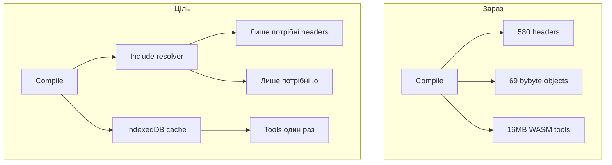
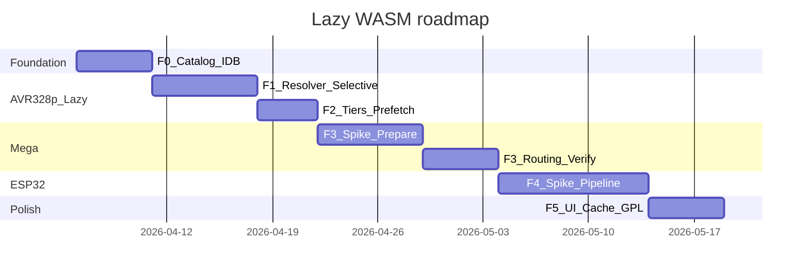

# Lazy load WASM + Mega + ESP32

## Цілі

1. **Не завантажувати ~54 MB upfront** — клієнт качає лише те, що потрібно для поточної плати + скетчу, решта в **IndexedDB**.
2. **Self-hosted** — bundles лежать на вашому static host (той самий origin або CDN), без GitHub Releases у runtime.
3. **Multi-platform**: AVR 328p (Uno/Nano, поточний) → **Mega 2560** → **ESP32**; Pico та ESP8266 — не в scope.

## Поточний стан (baseline)

| Компонент | Файл | Проблема |
|-----------|------|----------|
| Compiler | [`WebAvrWasmCompilerService`](src/app/platform/web/services/web-avr-wasm-compiler.service.ts) | лише `arduino:avr:uno/nano` |
| FQBN gate | [`web-avr-wasm.util.ts`](src/app/platform/web/services/web-avr-wasm.util.ts) | Mega/ESP відхиляються |
| Assets | [`prepare-bybyte-assets.mjs`](src/wasm-avr/prepare-bybyte-assets.mjs) | ~54 MB, 580 headers + 69 `.o` завжди |
| Link | patched [`firmware-builder.js`](src/wasm-avr/patch-firmware-builder.mjs) | `objectGroups.bybyte` — усі libs одразу |
| Catalog | [`libraries.w1.json`…`w7.json`](src/wasm-avr/) | metadata є, runtime resolver — ні |
| Contract | [`ICompiler`](src/app/core/interfaces/compiler.interface.ts) | один web impl |



---

## Фаза 0 — Каталог assets і IndexedDB cache (фундамент)

**Мета:** єдиний опис «що можна качати» + persistent cache між сесіями.

### 0.1 Генерація `wasm-catalog.json`

Новий скрипт [`src/wasm-avr/generate-catalog.mjs`](src/wasm-avr/generate-catalog.mjs) (викликається з `prepare:wasm-avr`):

```json
{
  "version": "1.0.0",
  "families": {
    "avr-328p": {
      "assetsBase": "/assets/wasm/avr-328p/",
      "fqbn": ["arduino:avr:uno", "arduino:avr:nano"],
      "tiers": {
        "tools": ["tools/cc1plus.wasm", "..."],
        "core": { "headers": [...], "objects": [...], "libs": [...] },
        "libraries": { "Stepper": { "includes": ["Stepper.h"], "depends": [], "headers": [...], "objects": [...] } }
      }
    }
  }
}
```

Джерела даних:
- npm `@horang-corp/avr-gcc-wasm` manifest → `tools`, `core`, `objectGroups.base/oled/tof`
- [`merge-manifest.mjs`](src/wasm-avr/merge-manifest.mjs) + `libraries.w*.json` → `libraries` з `depends` (додати поле `depends` у JSON, напр. Otto → `["Servo","EEPROM"]`)

### 0.2 `WasmAssetCacheService`

Новий сервіс [`src/app/platform/web/services/wasm-asset-cache.service.ts`](src/app/platform/web/services/wasm-asset-cache.service.ts):

- IndexedDB store: ключ `{catalogVersion}:{family}:{path}` → `ArrayBuffer`
- API: `get(path)`, `put(path, bytes)`, `has(path)`, `prefetch(paths, onProgress)`, `clearFamily(family)`
- In-memory LRU поверх IDB (швидкий повтор у тій же сесії)
- Версія catalog в ключі — після `prepare:wasm-avr` старий кеш не змішується

### 0.3 Конфіг base URL

[`environment.ts`](src/environments/environment.ts) — `wasmAssetsBase: '/assets/wasm/'` (prod CDN override).

### Критерій готовності

- Unit-тест: put/get/evict по версії
- `wasm-catalog.json` генерується з W1–W7, містить Stepper/Otto entries

---

## Фаза 1 — Lazy libraries для AVR 328p

**Мета:** Blink ≈ core + tools (~20–25 MB), Stepper +~100 KB при першому `#include <Stepper.h>`.

### 1.1 Include resolver

Новий [`src/app/platform/web/services/wasm-library-resolver.ts`](src/app/platform/web/services/wasm-library-resolver.ts):

1. Парсити `#include <...>` / `#include "..."` з preprocessed sketch ([`sketch-preprocessor.ts`](src/app/platform/web/services/sketch-preprocessor.ts))
2. Map header → library id (з catalog `libraries.*.includes`)
3. Розгорнути `depends` (transitive closure)
4. Додати sensor flags (OLED/TOF — [`detectWasmSensors`](src/app/platform/web/services/web-avr-wasm.util.ts))
5. Завжди включати `core` tier (Arduino.h, core `.o`, avr-libc)

Output: `{ headerPaths: string[], objectPaths: string[], includePaths: string[] }`

### 1.2 Selective load у firmware-builder

Розширити [`patch-firmware-builder.mjs`](src/wasm-avr/patch-firmware-builder.mjs):

- `loadHeaders(fs, headerPaths, fetchFn)` — не весь `manifest.headerFiles`
- `selectedObjectPaths(manifest, sensors, libraryIds)` — base + oled/tof + resolved libs (не весь `bybyte`)
- Inject custom `fetchBytes` через `setAssetFetcher(fn)` — delegating to `WasmAssetCacheService`

Alternativa (менший diff у JS glue): resolver у TypeScript передає `resolvedAssets` у `compile({ source, sensors, headers, objects, fetchBytes })` — патч export API в patched builder.

### 1.3 Оновити compiler service

[`WebAvrWasmCompilerService`](src/app/platform/web/services/web-avr-wasm-compiler.service.ts):

```
compile() → loadCatalog(family) → resolveLibraries(source) → prefetch(missing) → compile(resolved)
```

Progress через `UploadManagerService.progress$` (повідомлення «Завантаження Stepper…»).

### 1.4 Тести

- [`web-avr-wasm.util.spec.ts`](src/app/platform/web/__tests__/web-avr-wasm.util.spec.ts) — resolver: Blink → 0 bybyte libs; Stepper sketch → `[Stepper]`; Otto → transitive deps
- Integration: mock fetch + IDB, другий compile без network calls

### Критерій готовності

- Blink: network ≈ tools + core (перший раз), 0 KB (другий раз)
- Stepper: +1 lib перший раз, 0 KB другий раз
- Verify scripts `verify-w*.mjs` проходять з selective link

---

## Фаза 2 — Lazy tiers: tools prefetch і структура deploy

**Мета:** розділити deploy на board packs; prefetch при виборі плати.

### 2.1 Реструктуризація assets на disk

```
src/assets/wasm/
  catalog.json              # root pointer (~2 KB, в angular bundle)
  avr-328p/                 # поточний prepare output (перейменувати з wasm-avr)
    tools/
    assets/
    index.js
  avr-mega/                 # фаза 3
  esp32/                    # фаза 4
```

Оновити:
- [`prepare-bybyte-assets.mjs`](src/wasm-avr/prepare-bybyte-assets.mjs) → output `src/assets/wasm/avr-328p/`
- [`angular.json`](angular.json) — `src/assets/wasm/catalog.json` in bundle; решта static (same origin, lazy fetch)
- [`web-avr-wasm.util.ts`](src/app/platform/web/services/web-avr-wasm.util.ts) — `WASM_AVR_ASSETS_PATH` → family-aware

### 2.2 Prefetch on board select

[`DeviceManagerService`](src/app/modules/device/services/device-manager.service.ts) або upload panel:

- при зміні плати → `prefetchTier(family, 'tools')` + `prefetchTier(family, 'core')` у фоні
- UI: індикатор «Підготовка компілятора…» (optional chip у header)

### 2.3 HTTP caching (server)

Prod nginx/CDN: `Cache-Control: public, max-age=31536000, immutable` для `*.wasm`, `*.o` з hash/version у path або query `?v={catalogVersion}`.

### Критерій готовності

- Перший compile після вибору Nano швидший (tools уже в IDB)
- Deploy size на клієнті: catalog + app JS, не 54+ MB

---

## Фаза 3 — Mega (ATmega2560)

**Мета:** web compile для `arduino:avr:mega:cpu=atmega2560` ([`bybyte.profiles.ts`](src/app/modules/blockly/platforms/bybyte/bybyte.profiles.ts)).

### 3.1 Spike wasm-toolchains AVR Mega

Локально (one-off, не в CI спочатку):

1. Клон [wasm-toolchains](https://github.com/begeistert/wasm-toolchains) або взяти готовий `avrwasm.tar` з release
2. `node tools/arduino-wasm/build-sketch.cjs … mega examples/sketches/Blink.ino out.hex`
3. Документ spike: [`src/wasm-esp/README.md`](src/wasm-avr/README.md) розділ Mega

**Рішення після spike:** або vendor AVR bundle з wasm-toolchains (self-hosted extract), або розширити horang-corp recipe для `avr6` — рекомендація: **vendor wasm-toolchains AVR dist** (Mega вже в `recipe.js`: `atmega2560`, `avr6`).

### 3.2 Prepare pipeline Mega

Новий [`src/wasm-avr/prepare-mega-assets.mjs`](src/wasm-avr/prepare-mega-assets.mjs):

- Input: wasm-toolchains `dist-web/` (AVR, multilib avr6)
- Output: `src/assets/wasm/avr-mega/`
- Перезібрати ByByte `.o` для **avr6** (`-mmcu=atmega2560`) — той самий `compile-library-object.mjs`, інший MCU flag
- Окремий `libraries.w*.mega.json` або `mcu: "atmega2560"` у catalog entries (де pin-specific код — перевірити AFMotor, SoftwareSerial)

### 3.3 Board-specific link/compile args

Mega firmware-builder / recipe:

| Param | 328p | Mega |
|-------|------|------|
| MCU | atmega328p | atmega2560 |
| multilib | avr5 | avr6 |
| crt | crtatmega328p.o | crtatmega2560.o |
| flash limit | 32256 | 253952 |
| ldscript | avr5.xn | avr6.xn |

### 3.4 Compiler routing

Новий facade [`WebWasmCompilerService`](src/app/platform/web/services/web-wasm-compiler.service.ts) implements `ICompiler`:

```typescript
compile(options) {
  const family = resolveFamily(options.board); // avr-328p | avr-mega | esp32
  return this.delegates[family].compile(options);
}
```

[`web-platform.module.ts`](src/app/platform/web/web-platform.module.ts): `{ provide: ICompiler, useClass: WebWasmCompilerService }`.

Розширити FQBN:
- `arduino:avr:mega`, `arduino:avr:mega:cpu=atmega2560`

### 3.5 Verify Mega

- Fixtures: Blink, Servo, Stepper на Mega
- `npm run prepare:wasm-avr -- verify mega-w4` (новий verify script)

### Критерій готовності

- ByByte Mega profile compile → HEX, `fitsTarget` для 2560
- Lazy load: Mega pack не качається поки не обрано Mega

---

## Фаза 4 — ESP32

**Мета:** web compile для `esp32:esp32:esp32` (Otto ESP, MRT ESP). ESP8266 — backlog.

### 4.1 Spike ESP32 bundle

1. wasm-toolchains `esp32wasm.tar` → self-host extract → `src/assets/wasm/esp32/`
2. Node harness compile minimal Blink/WiFi-less sketch
3. Визначити output format: `.bin` (typical ESP32) vs `.hex` — розширити [`CompileResult`](src/app/core/models/compilation.model.ts): `binContent?: string` (base64) або `binPath`

### 4.2 ESP asset pipeline

Нова директорія [`src/wasm-esp/`](src/wasm-esp/):

- `prepare-esp32-assets.mjs` — harvest core + Tier-1 libs з wasm-toolchains
- `libraries.esp.json` — ESP-специфічні libs з `userlibs` (лише ті, що використовують generators для esp32 platform)
- **Не** переносити AVR W1–W7 blindly — окремий catalog

Scan generators: [`toolbox-builder.ts`](src/app/modules/blockly/lib/builders/toolbox-builder.ts) `boardId.includes("esp32")` blocks.

### 4.3 `WebEsp32WasmCompilerService`

- Окремий orchestrator (інший toolchain: xtensa gcc, не AVR cc1plus)
- Lazy load tiers: `esp32/tools/`, `esp32/core/`, `esp32/libraries/`
- Shared `WasmAssetCacheService` + `wasm-library-resolver` (той самий pattern, інший catalog family)

### 4.4 Blockly / compile constraints

Документувати в README які категорії **не** web-compile на ESP32 (Firebase, AsyncWebServer — лише desktop arduino-cli).

Upload ESP32 web — **окремий backlog** (esp-web-flasher); у цій фазі лише compile + HEX/bin у пам’яті.

### Критерій готовності

- ESP32 Blink compile in browser
- Lazy: ESP32 bundle не завантажується для Nano user
- ESP8266: зрозуміле повідомлення «поки лише desktop»

---

## Фаза 5 — UI, observability, hardening

### 5.1 Download progress UI

- Upload panel / compile button: progress bar при prefetch (`WasmAssetCacheService.prefetch`)
- Показати розмір: «Завантажено 12 / 45 MB»

### 5.2 Debug build log (з існуючого backlog)

[`avr_compile_adapters plan`](.cursor/plans/avr_compile_adapters_113ecfee.plan.md) фаза 4 — panel замість console.

### 5.3 Cache management

- Settings: «Очистити кеш компілятора» → `clearFamily('*')`
- Auto-evict: LRU max ~500 MB (configurable)

### 5.4 GPL / THIRD_PARTY_NOTICES

- Оновити notices для wasm-toolchains bundles (Mega, ESP32)
- Link «Corresponding Source» у About (якщо public release)

### 5.5 Test matrix

| Test | Scope |
|------|-------|
| resolver unit | headers → libs → deps |
| cache unit | IDB hit/miss, version bump |
| compile integration | Blink 328p, Stepper lazy, Mega Blink, ESP32 Blink |
| FQBN routing | mega/esp32 не падають з generic message |

---

## Порядок виконання (рекомендований)



1. **F0** — catalog + IndexedDB (блокує все інше)
2. **F1** — lazy libs на 328p (найбільший win для поточних users)
3. **F2** — tier prefetch + deploy layout
4. **F3** — Mega spike → prepare → routing
5. **F4** — ESP32 spike → prepare → compiler
6. **F5** — UI progress, cache mgmt, docs

---

## Ключові файли (нові / змінені)

| Файл | Дія |
|------|-----|
| `src/wasm-avr/generate-catalog.mjs` | NEW |
| `src/app/platform/web/services/wasm-asset-cache.service.ts` | NEW |
| `src/app/platform/web/services/wasm-library-resolver.ts` | NEW |
| `src/app/platform/web/services/web-wasm-compiler.service.ts` | NEW (facade) |
| `src/app/platform/web/services/web-esp32-wasm-compiler.service.ts` | NEW (F4) |
| `src/wasm-avr/prepare-mega-assets.mjs` | NEW (F3) |
| `src/wasm-esp/prepare-esp32-assets.mjs` | NEW (F4) |
| `src/wasm-avr/patch-firmware-builder.mjs` | MODIFY selective load |
| `src/wasm-avr/prepare-bybyte-assets.mjs` | MODIFY output path + catalog |
| `libraries.w*.json` | MODIFY add `depends` |
| `web-platform.module.ts` | MODIFY ICompiler → facade |
| `compilation.model.ts` | MODIFY optional `binContent` |

---

## Ризики і мітigaції

| Ризик | Мітigaція |
|-------|-----------|
| ByByte `.o` несумісні з Mega (avr6) | окремий prebuild pass; verify per wave |
| ESP32 toolchain ~50–80 MB | lazy tier + IDB; не quality в angular bundle |
| lib залежить від AVR-only registers | exclude з Mega catalog; compile-time error + doc |
| IndexedDB quota (Safari ~1GB) | LRU eviction; tools tier пріоритет |
| wasm-toolchains API ≠ horang | adapter layer у compiler service; не merge builders |

---

## Поза scope (backlog)

- Pico / RP2040
- ESP8266 web WASM (wasm-toolchains не покриває; Electron arduino-cli fallback)
- Web Serial upload Mega/ESP
- Service Worker offline (можна додати після F2)
