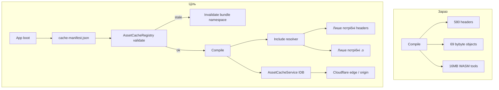
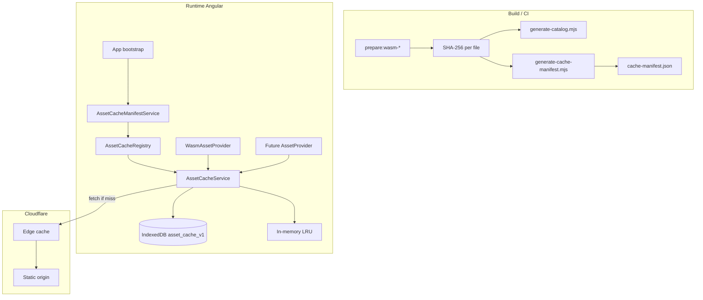
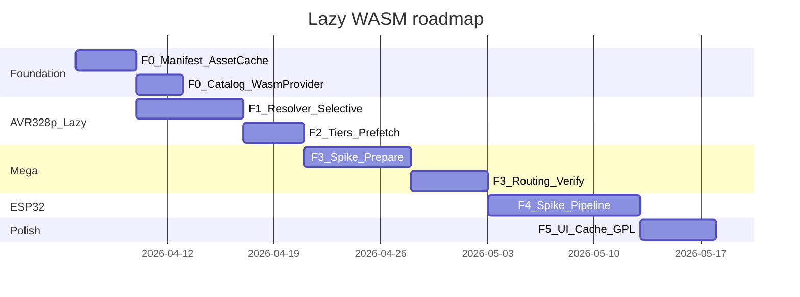

# Lazy load WASM + Mega + ESP32

## Цілі

1. **Не завантажувати ~54 MB upfront** — клієнт качає лише те, що потрібно для поточної плати + скетчу, решта в **IndexedDB**.
2. **Self-hosted + CDN** — bundles на static host / **Cloudflare**; aggressive edge cache для immutable assets.
3. **Уніфікований кеш з валідацією** — одна логіка версіонування/інвалідації для WASM, майбутніх asset packs (locales, block media, тощо); **ніколи не використовувати застарілий кеш** після оновлення lib/WASM/app.
4. **Multi-platform**: AVR 328p (Uno/Nano, поточний) → **Mega 2560** → **ESP32**; Pico та ESP8266 — не в scope.

## Поточний стан (baseline)

| Компонент | Файл | Проблема |
|-----------|------|----------|
| Compiler | [`WebAvrWasmCompilerService`](src/app/platform/web/services/web-avr-wasm-compiler.service.ts) | лише `arduino:avr:uno/nano` |
| FQBN gate | [`web-avr-wasm.util.ts`](src/app/platform/web/services/web-avr-wasm.util.ts) | Mega/ESP відхиляються |
| Assets | [`prepare-bybyte-assets.mjs`](src/wasm-avr/prepare-bybyte-assets.mjs) | ~54 MB, 580 headers + 69 `.o` завжди |
| Link | patched [`firmware-builder.js`](src/wasm-avr/patch-firmware-builder.mjs) | `objectGroups.bybyte` — усі libs одразу |
| Catalog | [`libraries.w1.json`…`w7.json`](src/wasm-avr/) | metadata є, runtime resolver — ні |
| Contract | [`ICompiler`](src/app/core/interfaces/compiler.interface.ts) | один web impl |



---

## Уніфікований кеш і версіонування (cross-cutting)

**Проблема:** lazy load без інвалідації → користувач тримає старі `.wasm`/`.o` після deploy; Cloudflare `max-age=31536000` посилить це. Окремий кеш на кожну фічу → дублювання логіки.

**Рішення:** один **Asset Cache Layer** для всіх downloadable bundles. WASM — перший consumer; наступні (i18n packs, toolbox media, future SW) підключаються тим самим API.

### Архітектура шарів



### `cache-manifest.json` (root, ~5–20 KB)

Генерується **`generate-cache-manifest.mjs`** (виклик з `prepare:wasm-avr`, `prepare:mega`, `prepare:esp32`, `npm run build:web`):

```json
{
  "schemaVersion": 1,
  "appMinVersion": "0.1.0",
  "generatedAt": "2026-04-06T12:00:00Z",
  "bundles": {
    "wasm-avr-328p": {
      "version": "1.4.2+w7.3",
      "contentHash": "sha256:bundle_aggregate…",
      "baseUrl": "/assets/wasm/avr-328p/",
      "catalogUrl": "/assets/wasm/avr-328p/wasm-catalog.json",
      "entryCount": 649,
      "totalBytes": 54321000
    },
    "wasm-avr-mega": { "version": "…", "contentHash": "…" },
    "wasm-esp32": { "version": "…", "contentHash": "…" }
  }
}
```

**Версія bundle** (`version`) — семантична або `prepare`-derived:
- `{npm @horang-corp version}+{bybyte waves hash}` для AVR 328p
- bump при зміні будь-якого `.wasm`, `.o`, patched `firmware-builder.js`, або `libraries.w*.json`

**Per-file hash** — у `wasm-catalog.json` (детальний індекс), не дублювати в root manifest:

```json
"files": {
  "tools/cc1plus.wasm": { "sha256": "a1b2…", "size": 8123456 }
}
```

### `AssetCacheRegistry` — валідація при старті та перед compile

Новий [`src/app/modules/asset-cache/services/asset-cache-registry.service.ts`](src/app/modules/asset-cache/services/asset-cache-registry.service.ts):

1. Завантажити `cache-manifest.json` (**короткий TTL на CDN**, див. нижче)
2. Прочитати локальний snapshot з IDB meta store: `{ bundleId → installedVersion, contentHash }`
3. Для кожного bundle:
   - `installedVersion !== manifest.version` **OR** `installedHash !== manifest.contentHash` → **`invalidateBundle(bundleId)`**
   - optional: per-file verify — якщо `catalog.files[path].sha256` ≠ stored hash → evict лише цей path
4. Записати новий snapshot після успішного prefetch tier
5. Emit `asset-cache-invalidated` для UI (toast «Оновлено компілятор»)

**Правило:** жоден `get(path)` не повертає bytes без перевірки `{bundleId, path}` проти поточного manifest. Ключ IDB:

```
{bundleId}:{fileSha256}:{logicalPath} → ArrayBuffer
```

`fileSha256` у ключі — content-addressed; зміна файлу = новий ключ, старі записи збирає LRU/eviction.

### `AssetCacheService` — універсальний store (не лише WASM)

Новий [`src/app/modules/asset-cache/services/asset-cache.service.ts`](src/app/modules/asset-cache/services/asset-cache.service.ts):

| API | Опис |
|-----|------|
| `validate(manifest)` | delegate → Registry |
| `get(bundleId, path)` | IDB → memory → network |
| `put(bundleId, path, bytes, meta)` | з hash у meta |
| `prefetch(bundleId, paths, onProgress)` | batch download |
| `invalidateBundle(bundleId)` | видалити namespace |
| `clearAll()` | settings «Очистити кеш» |
| `getStats()` | розмір, версії bundles |

`WasmAssetProvider` — thin adapter у `platform/web/`; **не** окремий IndexedDB.

Аналогія: [`WorkspaceStorageService`](src/app/modules/storage/workspace-storage.service.ts) вже має `STORAGE_VERSION` — той самий патерн, але для binary assets + CDN.

### CDN / Cloudflare (bandwidth + коректність)

| Asset type | URL pattern | Cache-Control (edge) | Invalidation |
|------------|-------------|----------------------|--------------|
| `cache-manifest.json` | `/assets/cache-manifest.json` | `public, max-age=60, stale-while-revalidate=300` | завжди свіжий проти IDB |
| `wasm-catalog.json` | `…/wasm-catalog.json` | `max-age=300` або tied to bundle version | bump bundle version |
| `.wasm`, `.o`, `.a` | `…/v{version}/tools/cc1plus.wasm` **або** `…/tools/cc1plus.{sha2568}.wasm` | `public, max-age=31536000, immutable` | content-addressed — purge не потрібен |
| `index.js` (glue) | versioned path | `immutable` | новий path при bump |

**Рекомендована схема deploy:** content-addressed filenames або prefix `v{bundleVersion}/` — Cloudflare кешує агресивно, клієнт інвалідує IDB за manifest, не за manual purge.

**Fallback purge:** CI step `cloudflare purge --urls /assets/cache-manifest.json` після deploy, якщо не content-addressed. Не покладатися лише на purge — **клієнтська валідація обов'язкова**.

**Bandwidth wins:**
- Edge cache HIT → origin не навантажується
- IDB HIT → network 0
- Lazy tier → качати лише потрібні libs
- `Accept-Encoding: br/gzip` на CDN (default CF)

### Build pipeline integration

```
npm run prepare:wasm-avr
  → prepare-bybyte-assets.mjs (build files)
  → generate-catalog.mjs (libraries + file hashes)
  → generate-cache-manifest.mjs (aggregate bundles, write src/assets/cache-manifest.json)

npm run build:web
  → embed manifest hash у environment (optional) для hard fail якщо CDN ≠ bundled app version
```

`package.json` scripts: `"generate:cache-manifest": "node src/wasm-avr/generate-cache-manifest.mjs"`.

### Майбутні consumers (той самий механізм)

| Bundle ID | Приклад | Коли |
|-----------|---------|------|
| `wasm-avr-328p` | F0–F1 | зараз |
| `wasm-avr-mega` | F3 | Mega |
| `wasm-esp32` | F4 | ESP32 |
| `blockly-locale-{lang}` | optional lazy JSON/TS chunks | backlog |
| `toolbox-media` | SVG/sprites pack | backlog |

Новий bundle = запис у `cache-manifest.json` + provider; **без** нового IDB schema.

### Критерії (versioning)

- [ ] Deploy нової lib (W5 bump) → наступний compile **не** використовує старі `.o` з IDB
- [ ] Зміна лише `cache-manifest.json` (без reload app) → `validate()` на наступному compile виявляє drift
- [ ] Cloudflare HIT + IDB stale manifest → Registry evict + re-fetch
- [ ] Unit: version bump, partial file hash mismatch, clearAll
- [ ] Integration: два prepare підряд з різним hash → другий compile re-downloads

---

## Фаза 0 — Каталог assets і IndexedDB cache (фундамент)

**Мета:** єдиний опис «що можна качати» + **версійований** persistent cache між сесіями.

### 0.0 Cache manifest + AssetCacheService (першочергово)

Реалізувати **до** selective resolver — інакше lazy cache зафіксує stale artifacts.

Файли:
- `src/wasm-avr/generate-cache-manifest.mjs` — NEW
- `src/app/modules/asset-cache/services/asset-cache.service.ts` — NEW
- `src/app/modules/asset-cache/services/asset-cache-registry.service.ts` — NEW
- `src/app/modules/asset-cache/services/asset-cache-manifest.service.ts` — NEW (fetch + parse manifest)
- `src/app/platform/web/services/wasm-asset.provider.ts` — NEW (wraps AssetCacheService)

`AppComponent` / `APP_INITIALIZER`: `assetCacheManifest.load()` → `registry.validate()` (non-blocking, але перед першим compile).

### 0.1 Генерація `wasm-catalog.json`

Новий скрипт [`src/wasm-avr/generate-catalog.mjs`](src/wasm-avr/generate-catalog.mjs) (викликається з `prepare:wasm-avr`):

```json
{
  "bundleId": "wasm-avr-328p",
  "version": "1.4.2+w7.3",
  "contentHash": "sha256:…",
  "families": {
    "avr-328p": {
      "assetsBase": "/assets/wasm/avr-328p/v1.4.2/",
      "fqbn": ["arduino:avr:uno", "arduino:avr:nano"],
      "files": {
        "tools/cc1plus.wasm": { "sha256": "…", "size": 8123456 }
      },
      "tiers": {
        "tools": ["tools/cc1plus.wasm", "..."],
        "core": { "headers": [...], "objects": [...], "libs": [...] },
        "libraries": { "Stepper": { "includes": ["Stepper.h"], "depends": [], "headers": [...], "objects": [...] } }
      }
    }
  }
}
```

`version` / `contentHash` **must match** entry in root `cache-manifest.json`.

Джерела даних:
- npm `@horang-corp/avr-gcc-wasm` manifest → `tools`, `core`, `objectGroups.base/oled/tof`
- [`merge-manifest.mjs`](src/wasm-avr/merge-manifest.mjs) + `libraries.w*.json` → `libraries` з `depends` (додати поле `depends` у JSON, напр. Otto → `["Servo","EEPROM"]`)

### 0.2 `WasmAssetProvider` (delegates `AssetCacheService`)

[`src/app/platform/web/services/wasm-asset.provider.ts`](src/app/platform/web/services/wasm-asset.provider.ts):

- Bundle ID: `wasm-avr-328p` (Mega/ESP32 — свої IDs)
- API: `get(path)`, `prefetch(paths, onProgress)`, `ensureBundleValid()` → calls Registry
- **Не** власний IndexedDB — лише namespace над `AssetCacheService`
- Fetch URL: `{assetsBase}{path}` де `assetsBase` з validated catalog (versioned prefix)

### 0.3 Конфіг base URL

[`environment.ts`](src/environments/environment.ts):

```typescript
assetCacheManifestUrl: '/assets/cache-manifest.json',
wasmAssetsBase: '/assets/wasm/',  // prod: https://cdn.example.com/assets/wasm/
```

Optional: `environment.wasmManifestEtag` / `buildId` — якщо embedded manifest ≠ fetched → force validate.

### Критерій готовності

- Unit: Registry invalidates on version/hash bump; AssetCacheService put/get з content hash key
- Unit: stale IDB entry ignored after manifest update
- `wasm-catalog.json` + `cache-manifest.json` генеруються з W1–W7, file hashes present
- Docs: [`docs/compile-upload/wasm-avr-assets.md`](docs/compile-upload/wasm-avr-assets.md) — розділ «Cache & CDN»

---

## Фаза 1 — Lazy libraries для AVR 328p

**Мета:** Blink ≈ core + tools (~20–25 MB), Stepper +~100 KB при першому `#include <Stepper.h>`.

### 1.1 Include resolver

Новий [`src/app/platform/web/services/wasm-library-resolver.ts`](src/app/platform/web/services/wasm-library-resolver.ts):

1. Парсити `#include <...>` / `#include "..."` з preprocessed sketch ([`sketch-preprocessor.ts`](src/app/platform/web/services/sketch-preprocessor.ts))
2. Map header → library id (з catalog `libraries.*.includes`)
3. Розгорнути `depends` (transitive closure)
4. Додати sensor flags (OLED/TOF — [`detectWasmSensors`](src/app/platform/web/services/web-avr-wasm.util.ts))
5. Завжди включати `core` tier (Arduino.h, core `.o`, avr-libc)

Output: `{ headerPaths: string[], objectPaths: string[], includePaths: string[] }`

### 1.2 Selective load у firmware-builder

Розширити [`patch-firmware-builder.mjs`](src/wasm-avr/patch-firmware-builder.mjs):

- `loadHeaders(fs, headerPaths, fetchFn)` — не весь `manifest.headerFiles`
- `selectedObjectPaths(manifest, sensors, libraryIds)` — base + oled/tof + resolved libs (не весь `bybyte`)
- Inject custom `fetchBytes` через `setAssetFetcher(fn)` — delegating to `WasmAssetProvider` → `AssetCacheService`

Alternativa (менший diff у JS glue): resolver у TypeScript передає `resolvedAssets` у `compile({ source, sensors, headers, objects, fetchBytes })` — патч export API в patched builder.

### 1.3 Оновити compiler service

[`WebAvrWasmCompilerService`](src/app/platform/web/services/web-avr-wasm-compiler.service.ts):

```
compile() → registry.ensureValid(bundleId) → loadCatalog(family) → resolveLibraries(source)
         → prefetch(missing) → compile(resolved)
```

`ensureValid` — no-op якщо manifest match; інакше evict + optional user message.

Progress через `UploadManagerService.progress$` (повідомлення «Завантаження Stepper…»).

### 1.4 Тести

- [`web-avr-wasm.util.spec.ts`](src/app/platform/web/__tests__/web-avr-wasm.util.spec.ts) — resolver: Blink → 0 bybyte libs; Stepper sketch → `[Stepper]`; Otto → transitive deps
- Integration: mock fetch + IDB, другий compile без network calls

### Критерій готовності

- Blink: network ≈ tools + core (перший раз), 0 KB (другий раз)
- Stepper: +1 lib перший раз, 0 KB другий раз
- Verify scripts `verify-w*.mjs` проходять з selective link

---

## Фаза 2 — Lazy tiers: tools prefetch і структура deploy

**Мета:** розділити deploy на board packs; prefetch при виборі плати.

### 2.1 Реструктуризація assets на disk

```
src/assets/
  cache-manifest.json       # root — короткий TTL, validate on boot
  wasm/
    avr-328p/
      v1.4.2/               # version prefix (immutable CDN cache)
        wasm-catalog.json
        tools/
        assets/
        index.js
    avr-mega/               # фаза 3
    esp32/                  # фаза 4
```

Оновити:
- [`prepare-bybyte-assets.mjs`](src/wasm-avr/prepare-bybyte-assets.mjs) → output `src/assets/wasm/avr-328p/`
- [`angular.json`](angular.json) — `cache-manifest.json` in bundle (fallback offline); решта static lazy fetch
- [`web-avr-wasm.util.ts`](src/app/platform/web/services/web-avr-wasm.util.ts) — `WASM_AVR_ASSETS_PATH` → family-aware

### 2.2 Prefetch on board select

[`DeviceManagerService`](src/app/modules/device/services/device-manager.service.ts) або upload panel:

- при зміні плати → `prefetchTier(family, 'tools')` + `prefetchTier(family, 'core')` у фоні
- UI: індикатор «Підготовка компілятора…» (optional chip у header)

### 2.3 HTTP caching (Cloudflare / origin)

Див. розділ **Уніфікований кеш і версіонування** — правила Cache-Control per asset type.

Cloudflare Page Rules / Cache Rules (приклад):
- `*/assets/cache-manifest.json` → Bypass або Edge TTL 60s
- `*/assets/wasm/*/v*/*` → Cache Everything, Edge TTL 1 year
- Brotli + HTTP/2 enabled

CI (optional): `wrangler pages deploy` / API purge manifest URL після release — **допоміжно**, не заміна client validate.

### 2.4 Deploy version bump workflow

1. Developer merges lib change → `prepare:wasm-avr` bumps `wasm-avr-328p.version`
2. `generate-cache-manifest.mjs` оновлює aggregate hash
3. Deploy static to CDN (новий prefix `v1.4.3/`)
4. Deploy app (новий `cache-manifest.json` URL або hash)
5. Clients: boot validate → evict `v1.4.2` IDB keys → lazy re-fetch with edge HIT

### Критерій готовності

- Перший compile після вибору Nano швидший (tools уже в IDB, **valid** version)
- Deploy size на клієнті: manifest + app JS, не 54+ MB
- Stale Cloudflare + fresh manifest → client re-downloads correct version

---

## Фаза 3 — Mega (ATmega2560)

**Мета:** web compile для `arduino:avr:mega:cpu=atmega2560` ([`bybyte.profiles.ts`](src/app/modules/blockly/platforms/bybyte/bybyte.profiles.ts)).

### 3.1 Spike wasm-toolchains AVR Mega

Локально (one-off, не в CI спочатку):

1. Клон [wasm-toolchains](https://github.com/begeistert/wasm-toolchains) або взяти готовий `avrwasm.tar` з release
2. `node tools/arduino-wasm/build-sketch.cjs … mega examples/sketches/Blink.ino out.hex`
3. Документ spike: [`docs/compile-upload/wasm-avr-assets.md`](docs/compile-upload/wasm-avr-assets.md) — розділ Mega

**Рішення після spike:** або vendor AVR bundle з wasm-toolchains (self-hosted extract), або розширити horang-corp recipe для `avr6` — рекомендація: **vendor wasm-toolchains AVR dist** (Mega вже в `recipe.js`: `atmega2560`, `avr6`).

### 3.2 Prepare pipeline Mega

Новий [`src/wasm-avr/prepare-mega-assets.mjs`](src/wasm-avr/prepare-mega-assets.mjs):

- Input: wasm-toolchains `dist-web/` (AVR, multilib avr6)
- Output: `src/assets/wasm/avr-mega/`
- Перезібрати ByByte `.o` для **avr6** (`-mmcu=atmega2560`) — той самий `compile-library-object.mjs`, інший MCU flag
- Окремий `libraries.w*.mega.json` або `mcu: "atmega2560"` у catalog entries (де pin-specific код — перевірити AFMotor, SoftwareSerial)

### 3.3 Board-specific link/compile args

Mega firmware-builder / recipe:

| Param | 328p | Mega |
|-------|------|------|
| MCU | atmega328p | atmega2560 |
| multilib | avr5 | avr6 |
| crt | crtatmega328p.o | crtatmega2560.o |
| flash limit | 32256 | 253952 |
| ldscript | avr5.xn | avr6.xn |

### 3.4 Compiler routing

Новий facade [`WebWasmCompilerService`](src/app/platform/web/services/web-wasm-compiler.service.ts) implements `ICompiler`:

```typescript
compile(options) {
  const family = resolveFamily(options.board); // avr-328p | avr-mega | esp32
  return this.delegates[family].compile(options);
}
```

[`web-platform.module.ts`](src/app/platform/web/web-platform.module.ts): `{ provide: ICompiler, useClass: WebWasmCompilerService }`.

Розширити FQBN:
- `arduino:avr:mega`, `arduino:avr:mega:cpu=atmega2560`

### 3.5 Verify Mega

- Fixtures: Blink, Servo, Stepper на Mega
- `npm run prepare:wasm-avr -- verify mega-w4` (новий verify script)

### Критерій готовності

- ByByte Mega profile compile → HEX, `fitsTarget` для 2560
- Lazy load: Mega pack не качається поки не обрано Mega

---

## Фаза 4 — ESP32

**Мета:** web compile для `esp32:esp32:esp32` (Otto ESP, MRT ESP). ESP8266 — backlog.

### 4.1 Spike ESP32 bundle

1. wasm-toolchains `esp32wasm.tar` → self-host extract → `src/assets/wasm/esp32/`
2. Node harness compile minimal Blink/WiFi-less sketch
3. Визначити output format: `.bin` (typical ESP32) vs `.hex` — розширити [`CompileResult`](src/app/core/models/compilation.model.ts): `binContent?: string` (base64) або `binPath`

### 4.2 ESP asset pipeline

Нова директорія [`src/wasm-esp/`](src/wasm-esp/):

- `prepare-esp32-assets.mjs` — harvest core + Tier-1 libs з wasm-toolchains
- `libraries.esp.json` — ESP-специфічні libs з `userlibs` (лише ті, що використовують generators для esp32 platform)
- **Не** переносити AVR W1–W7 blindly — окремий catalog

Scan generators: [`toolbox-builder.ts`](src/app/modules/blockly/lib/builders/toolbox-builder.ts) `boardId.includes("esp32")` blocks.

### 4.3 `WebEsp32WasmCompilerService`

- Окремий orchestrator (інший toolchain: xtensa gcc, не AVR cc1plus)
- Lazy load tiers: `esp32/tools/`, `esp32/core/`, `esp32/libraries/`
- Shared `AssetCacheService` / `WasmAssetProvider` + `wasm-library-resolver` (bundle `wasm-esp32`, той самий Registry)

### 4.4 Blockly / compile constraints

Документувати в README які категорії **не** web-compile на ESP32 (Firebase, AsyncWebServer — лише desktop arduino-cli).

Upload ESP32 web — **окремий backlog** (esp-web-flasher); у цій фазі лише compile + HEX/bin у пам’яті.

### Критерій готовності

- ESP32 Blink compile in browser
- Lazy: ESP32 bundle не завантажується для Nano user
- ESP8266: зрозуміле повідомлення «поки лише desktop»

---

## Фаза 5 — UI, observability, hardening

### 5.1 Download progress UI

- Upload panel / compile button: progress bar при prefetch (`AssetCacheService.prefetch`)
- Показати розмір: «Завантажено 12 / 45 MB»
- Якщо `asset-cache-invalidated` — коротке повідомлення «Оновлено компілятор, завантаження…»

### 5.2 Debug build log (з існуючого backlog)

[`avr_compile_adapters plan`](.cursor/plans/avr_compile_adapters_113ecfee.plan.md) фаза 4 — panel замість console.

### 5.3 Cache management

- Settings: «Очистити кеш завантажень» → `AssetCacheService.clearAll()`
- Settings (debug): показати installed bundle versions vs manifest
- Auto-evict: LRU max ~500 MB (configurable); evict oldest **superseded** bundle versions first
- Manual «Перевірити оновлення» → `registry.validate({ force: true })`

### 5.4 GPL / THIRD_PARTY_NOTICES

- Оновити notices для wasm-toolchains bundles (Mega, ESP32)
- Link «Corresponding Source» у About (якщо public release)

### 5.5 Test matrix

| Test | Scope |
|------|-------|
| resolver unit | headers → libs → deps |
| cache unit | IDB hit/miss, Registry invalidate on version/hash bump |
| manifest unit | parse, bundle drift detection, per-file hash mismatch |
| CDN integration | mock fetch with Cache-Control headers; stale edge simulation |
| compile integration | Blink 328p, Stepper lazy, Mega Blink, ESP32 Blink |
| FQBN routing | mega/esp32 не падають з generic message |

---

## Порядок виконання (рекомендований)



1. **F0** — `cache-manifest` + `AssetCacheService` + Registry (блокує все інше; WASM — перший bundle)
2. **F1** — lazy libs на 328p (найбільший win для поточних users)
3. **F2** — tier prefetch + deploy layout
4. **F3** — Mega spike → prepare → routing
5. **F4** — ESP32 spike → prepare → compiler
6. **F5** — UI progress, cache mgmt, docs

---

## Ключові файли (нові / змінені)

| Файл | Дія |
|------|-----|
| `src/wasm-avr/generate-cache-manifest.mjs` | NEW |
| `src/wasm-avr/generate-catalog.mjs` | NEW (+ per-file sha256) |
| `src/assets/cache-manifest.json` | NEW (generated) |
| `src/app/modules/asset-cache/services/asset-cache.service.ts` | NEW |
| `src/app/modules/asset-cache/services/asset-cache-registry.service.ts` | NEW |
| `src/app/modules/asset-cache/services/asset-cache-manifest.service.ts` | NEW |
| `src/app/platform/web/services/wasm-asset.provider.ts` | NEW |
| `src/app/platform/web/services/wasm-library-resolver.ts` | NEW |
| `src/app/platform/web/services/web-wasm-compiler.service.ts` | NEW (facade) |
| `src/app/platform/web/services/web-esp32-wasm-compiler.service.ts` | NEW (F4) |
| `src/wasm-avr/prepare-mega-assets.mjs` | NEW (F3) |
| `src/wasm-esp/prepare-esp32-assets.mjs` | NEW (F4) |
| `src/wasm-avr/patch-firmware-builder.mjs` | MODIFY selective load |
| `src/wasm-avr/prepare-bybyte-assets.mjs` | MODIFY output path + catalog |
| `libraries.w*.json` | MODIFY add `depends` |
| `web-platform.module.ts` | MODIFY ICompiler → facade |
| `compilation.model.ts` | MODIFY optional `binContent` |

---

## Ризики і мітigaції

| Ризик | Мітigaція |
|-------|-----------|
| ByByte `.o` несумісні з Mega (avr6) | окремий prebuild pass; verify per wave |
| ESP32 toolchain ~50–80 MB | lazy tier + IDB; не quality в angular bundle |
| lib залежить від AVR-only registers | exclude з Mega catalog; compile-time error + doc |
| IndexedDB quota (Safari ~1GB) | LRU eviction; tools tier пріоритет; drop superseded bundle versions |
| wasm-toolchains API ≠ horang | adapter layer у compiler service; не merge builders |
| CDN stale + long IDB TTL | **client-side manifest validate** (обов'язково); content-addressed URLs |
| Version skew app vs CDN | embed `buildId` in app; compare manifest on boot |
| Кожна фіча свій кеш | **AssetCacheService** єдиний; bundleId namespace |

---

## Поза scope (backlog)

- Pico / RP2040
- ESP8266 web WASM (wasm-toolchains не покриває; Electron arduino-cli fallback)
- Web Serial upload Mega/ESP
- Service Worker offline — optional; якщо додавати, **лише** як transport для `AssetCacheService`, manifest validate лишається в Registry (не дублювати SW cache keys)
