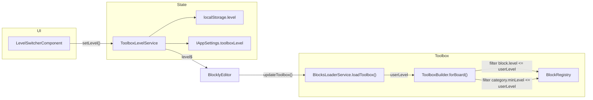

# Перемикач рівнів Beginner / Middle / Pro

## Поточний стан

- **Legacy** ([`www/js/blocklino.js`](www/js/blocklino.js)): кнопки рівнів, `localStorage.level` (1/2/3), toolbox збирається з `defaultCategories1/2/3` у [`www/toolbox/toolbox_arduino_all.xml`](www/toolbox/toolbox_arduino_all.xml).
- **Angular**: enum `BlockLevelE` (BEGINNER / INTERMEDIATE / ADVANCED) уже є в [`src/app/modules/blockly/types/block.types.ts`](src/app/modules/blockly/types/block.types.ts), поля `level` на блоках і `minLevel` на категоріях задані, але:
  - UI перемикача **немає**
  - `ToolboxBuilder` ігнорує `minLevel` категорій
  - `includeAdvancedBlocks: false` жорстко приховує ADVANCED
  - поточні рівні категорій **не відповідають** legacy (напр. `variables` = BEGINNER, а в legacy Variables лише з рівня 2)



## Мапінг legacy → Angular

| Рівень | Legacy | Angular (категорії / підкатегорії) |
|--------|--------|-------------------------------------|
| **Beginner** | CAT_ARDUINO, CAT_OTTO, matrice8x8/16x8, OLED, BUZZER, ultrason, TIME, LOGIC, MATH | `generic`, `time`, `logic`, `math`, Otto platform, LED: `NeoMatrix` + `Matrix`, Displays: `OLED`, Audio: `Buzzer`, Sensing: `Distance` |
| **Middle** | + servo, Displays, AUDIO, SENSORS, com, FUNCTIONS, VARIABLES | + `variables`, `functions`, Motors: `Servo`, Displays: `TFT`/`LCD`, Audio: решта, Sensing: решта, Communication: Serial/SoftSerial/Bluetooth/Remote, LED: `Basic` |
| **Pro** | + motors, TEXT, TAB, STOCKAGE, ARDUINO_IN, MUVISION, KEYBOARD | + `text`, `arrays`, `storage`, `ports`, Motors: DC/Stepper/MRT, Communication: `Keyboard`/`MuVision`, LED: `RGB`/`NeoPixel`, `iot` (ESP), Escornabot та інші platform packs |

> Блоки на workspace **не видаляються** при зниженні рівня (як у legacy) — змінюється лише видимість у toolbox.

## Крок 1 — Сервіс стану рівня

Новий файл: [`src/app/modules/blockly/services/toolbox-level.service.ts`](src/app/modules/blockly/services/toolbox-level.service.ts)

- Enum-аліас або type `ToolboxUserLevel = BlockLevelE`
- Default: `BlockLevelE.BEGINNER` (або відновлення з `localStorage.getItem('level')` → map 1→BEGINNER, 2→INTERMEDIATE, 3→ADVANCED для сумісності з legacy)
- API: `getLevel()`, `setLevel(level)`, `level$: Observable<BlockLevelE>`
- Збереження: `localStorage.level` + `WorkspaceStorageService.saveSettings({ toolboxLevel })`
- Розширити [`IAppSettings`](src/app/modules/storage/workspace-storage.service.ts): `toolboxLevel?: BlockLevelE`

## Крок 2 — UI компонент

Новий: [`src/app/modules/blockly/components/level-switcher/`](src/app/modules/blockly/components/level-switcher/)

- Segmented button group з текстовими мітками **Beginner / Middle / Pro** (обрано користувачем)
- Підключити в [`src/app/app.component.html`](src/app/app.component.html) поруч з `app-lang-switcher`
- Стилі узгодити з header ([`src/app/app.component.scss`](src/app/app.component.scss), [`lang-switcher.component.scss`](src/app/modules/language/components/lang-switcher/lang-switcher.component.scss))
- Зареєструвати в [`blockly.module.ts`](src/app/modules/blockly/blockly.module.ts)

## Крок 3 — Фільтрація toolbox

### [`src/app/modules/blockly/types/toolbox.types.ts`](src/app/modules/blockly/types/toolbox.types.ts)

Додати до `ToolboxOptions`:
```typescript
userLevel?: BlockLevelE;  // max visible level
```

### [`src/app/modules/blockly/lib/builders/toolbox-builder.ts`](src/app/modules/blockly/lib/builders/toolbox-builder.ts)

- Замінити логіку `includeAdvancedBlocks` на `userLevel` (deprecated-прапорець залишити для сумісності)
- **`collectFilteredBlocks()`**: `block.level <= userLevel`
- **`_isCategoryVisible()`**: `!config.minLevel || config.minLevel <= userLevel` (важливо для custom flyout: Variables, Procedures)
- Default `userLevel = BlockLevelE.ADVANCED` (показати все, якщо не передано)

### [`src/app/modules/blockly/services/blocks-loader.service.ts`](src/app/modules/blockly/services/blocks-loader.service.ts)

```typescript
async loadToolbox(boardId: string, userLevel?: BlockLevelE): Promise<any>
```
- Інжектити `ToolboxLevelService`, передавати `userLevel` у `ToolboxBuilder.forBoard()`

### [`src/app/modules/blockly/components/blockly-editor/blockly-editor.component.ts`](src/app/modules/blockly/components/blockly-editor/blockly-editor.component.ts)

- Підписатися на `toolboxLevelService.level$`
- При зміні рівня: `loadToolbox(boardId, level)` → `workspace.updateToolbox()` → `setupToolboxIcons()` (аналогічно зміні плати / мови)
- Передавати рівень при початковому завантаженні та при `language-changed`

## Крок 4 — Перепризначення рівнів блоків/категорій

Оновити `config.ts` та `index.ts` реєстрації категорій у модулях definitions + platforms.

**Приклади ключових змін:**

| Модуль | BEGINNER | INTERMEDIATE | ADVANCED |
|--------|----------|--------------|----------|
| [`variables/config.ts`](src/app/modules/blockly/definitions/variables/config.ts) | — | ✓ | — |
| [`text/config.ts`](src/app/modules/blockly/definitions/text/config.ts) | — | — | ✓ |
| [`ports/config.ts`](src/app/modules/blockly/definitions/ports/config.ts) | — | — | ✓ |
| [`arrays/config.ts`](src/app/modules/blockly/definitions/arrays/config.ts) | — | — | ✓ |
| [`storage/config.ts`](src/app/modules/blockly/definitions/storage/config.ts) | — | — | ✓ |
| [`iot/config.ts`](src/app/modules/blockly/definitions/iot/config.ts) | — | — | ✓ |
| [`led/index.ts`](src/app/modules/blockly/definitions/led/index.ts) | NeoMatrix, Matrix | Basic | RGB, NeoPixel |
| [`displays/index.ts`](src/app/modules/blockly/definitions/displays/index.ts) | OLED | TFT, LCD | — |
| [`audio/index.ts`](src/app/modules/blockly/definitions/audio/index.ts) | Buzzer | DFPlayer, OpenSmart, Radio | — |
| [`sensing/index.ts`](src/app/modules/blockly/definitions/sensing/index.ts) | Distance | решта підкатегорій | — |
| [`communication/index.ts`](src/app/modules/blockly/definitions/communication/index.ts) | — | Serial, SoftSerial, BT, Remote | Keyboard, MuVision |
| [`motors/index.ts`](src/app/modules/blockly/definitions/motors/index.ts) | — | Servo | DC, Stepper, MRT |
| [`platforms/otto/config.ts`](src/app/modules/blockly/platforms/otto/config.ts) | ✓ | — | — |

Для кожної підкатегорії з іншим рівнем:
1. Експортувати константу рівня в `config.ts` (напр. `NEOMATRIX_LEVEL = BlockLevelE.BEGINNER`)
2. Передати `minLevel` у `registerCategory()`
3. Оновити `.setLevel(...)` у відповідних `*.blocks.ts` (імпорт рівня підкатегорії замість загального `TOOLBOX_LEVEL`)

## Крок 5 — Переклади

Додати ключі в [`src/app/modules/language/translations/en.ts`](src/app/modules/language/translations/en.ts), [`uk.ts`](src/app/modules/language/translations/uk.ts) та інші мови:

- `LEVEL_LABEL` — «Level:»
- `LEVEL_BEGINNER` — «Beginner»
- `LEVEL_MIDDLE` — «Middle»
- `LEVEL_PRO` — «Pro`

## Перевірка

1. Beginner: видно generic, logic, math, time, Otto, matrix/OLED/buzzer/ultrasonic; **не** видно variables, text, IoT, ports
2. Middle: + variables, functions, servo, повні sensors/displays/audio/com
3. Pro: + text, arrays, storage, ports, motors, keyboard, muvision, IoT
4. Перемикання рівня зберігається після reload (`localStorage.level`)
5. Зміна плати / мови не скидає рівень
6. Блоки на canvas залишаються при зниженні рівня
