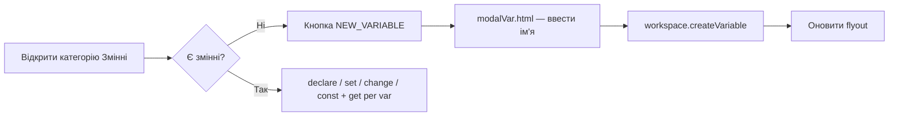
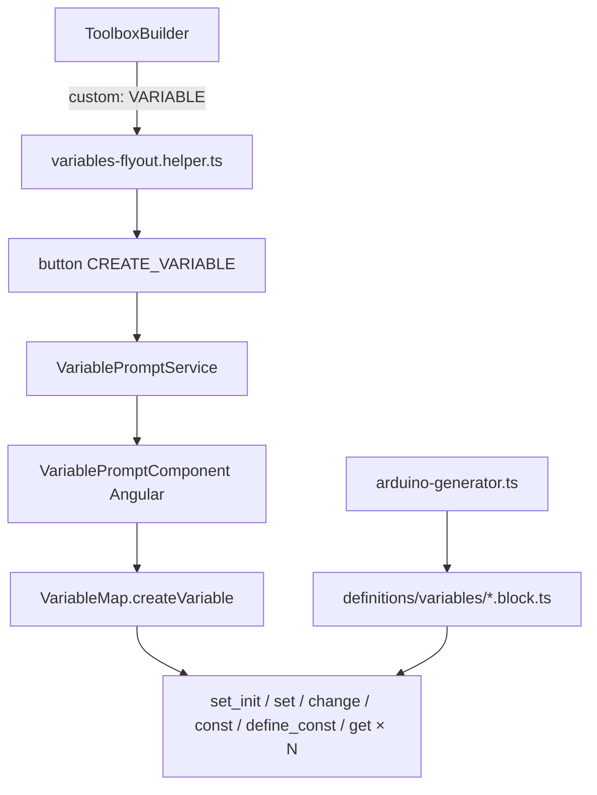

# Рефакторинг категорії «Змінні»

## Діагностика поточного стану

### Чому зараз з'являються `i`, `j`, `k` автоматично

Категорія змінних збирається **статично** через [`ToolboxBuilder.buildCategories()`](src/app/modules/blockly/lib/builders/toolbox-builder.ts) — у flyout одразу потрапляють усі 4 блоки з [`definitions/variables/`](src/app/modules/blockly/definitions/variables/).

При створенні блоку в flyout `FieldVariable` (Blockly 13) автоматично:
1. генерує унікальне ім'я (`i` → `j` → `k`…);
2. додає змінну в `workspace.getVariableMap()`.

Це стандартна поведінка Blockly, але **не та UX-модель**, яка була в legacy.

### Що було в legacy (цільова поведінка)

У [`www/js/blocklino.js`](www/js/blocklino.js) (рядки 622–729) перевизначено `Blockly.Variables.flyoutCategory`:



- Спочатку лише кнопка «Створити змінну».
- Після створення — блоки роботи з даними для кожної змінної.
- Ім'я задається через діалог (legacy: Electron [`www/modalVar.html`](www/modalVar.html)).

### Помилка `Non-empty variable map` (окремий баг)

Стек: [`blockly-editor.component.ts:148`](src/app/modules/blockly/components/blockly-editor/blockly-editor.component.ts) — `this.workspace.clear()` при зміні мови.

У Blockly 13 `VariableMap.clear()` кидає помилку, якщо в workspace є змінні. Після збереження стану workspace (де вже є `i`) виклик `clear()` падає **до** перезавантаження стану.

**Швидкий фікс (фаза 0):** прибрати `workspace.clear()` — достатньо `updateToolbox()` + `Blockly.serialization.workspaces.load(state, workspace)` для оновлення перекладів без скидання variable map.

---

## Цільова архітектура



Ключова зміна: категорія змінних **не є звичайною static-категорією** з BlockRegistry, а **dynamic custom flyout** (аналог уже запланованого `infra-custom-flyout` у [general_block_categories plan](.cursor/plans/general_block_categories_1d26dd3c.plan.md)).

---

## Фаза 0 — Виправити crash при зміні мови (0.5 дня)

**Файл:** [`blockly-editor.component.ts`](src/app/modules/blockly/components/blockly-editor/blockly-editor.component.ts)

Замінити блок language-changed handler:

```typescript
// Було (падає):
this.workspace.clear();
Blockly.serialization.workspaces.load(workspaceState, this.workspace);

// Стане:
Blockly.serialization.workspaces.load(workspaceState, this.workspace, { recordUndo: false });
this.workspace.refreshToolboxSelection();
```

Якщо load не оновлює текст блоків — додати `this.workspace.getAllBlocks(false).forEach(b => b.initSvg())` або dispose+recreate через serialization (без `clear()`).

---

## Фаза 1 — Dynamic flyout для категорії (1–1.5 дня)

### 1.1 ToolboxBuilder — special case для Variables

**Файл:** [`toolbox-builder.ts`](src/app/modules/blockly/lib/builders/toolbox-builder.ts)

У `buildCategories()` для `CATEGORY_NAME === "%{BKY_CAT_VARIABLES}"`:

```typescript
{
  kind: 'category',
  name: CATEGORY_NAME,
  colour: '32',
  custom: 'VARIABLE',   // без static contents
  // cssconfig для іконки — зберегти
}
```

Блоки `variables_*` **виключити** зі static contents (не показувати через `groupBlocksByCategory`).

**Файл:** [`variables/index.ts`](src/app/modules/blockly/definitions/variables/index.ts) — розкоментувати/додати `custom: 'VARIABLE'` у `registerCategory` metadata (якщо ToolboxBuilder читає це поле).

### 1.2 Custom flyout callback

**Новий файл:** [`src/app/modules/blockly/lib/toolbox/variables-flyout.helper.ts`](src/app/modules/blockly/lib/toolbox/variables-flyout.helper.ts)

Порт логіки з [`blocklino.js:622-729`](www/js/blocklino.js):

| Елемент flyout | Умова |
|----------------|-------|
| `{ kind: 'button', text: NEW_VARIABLE, callbackKey: 'CREATE_VARIABLE' }` | завжди |
| `variables_set_init` | є ≥1 змінна, arduino mode |
| `variables_set` | є ≥1 змінна |
| `math_change` | є ≥1 змінна |
| `variables_const` | є ≥1 змінна (новий блок) |
| `base_define_const` | є ≥1 змінна (новий блок) |
| `variables_get` | **по одному на кожну змінну** |

Реєстрація (ініціалізація в [`blocks-loader.service.ts`](src/app/modules/blockly/services/blocks-loader.service.ts) або editor init):

```typescript
Blockly.common.registerToolboxCategoryCallback('VARIABLE', buildVariablesFlyout);
Blockly.common.registerButtonCallback('CREATE_VARIABLE', onCreateVariable);
```

Після `createVariable` / `deleteVariable` / `renameVariable` — `workspace.refreshToolboxSelection()` для оновлення flyout.

---

## Фаза 2 — Angular-модалка створення змінної (1 день)

### 2.1 Компонент і сервіс

**Нові файли:**
- [`variable-prompt.component.ts/html/scss`](src/app/modules/blockly/components/variable-prompt/) — модалка з полем імені + OK/Cancel
- [`variable-prompt.service.ts`](src/app/modules/blockly/services/variable-prompt.service.ts) — Promise-based API для Blockly callback

**Поведінка:**
- При відкритті: запропонувати `Blockly.Variables.generateUniqueName(workspace)` (i → j → k…)
- Користувач може змінити ім'я перед підтвердженням
- Валідація: non-empty, унікальність, Arduino-safe ідентифікатор (буква/underscore + alnum), не reserved word (перевірка через `Blockly.Names` або список з generator)
- При дублікаті — показати помилку в модалці (legacy: `VARIABLE_ALREADY_EXISTS`)

### 2.2 Підключення до Blockly

**Файл:** [`blocks-loader.service.ts`](src/app/modules/blockly/services/blocks-loader.service.ts)

```typescript
// Override Blockly prompt для rename/delete з FieldVariable dropdown
Blockly.dialog.setPrompt((message, defaultValue, callback) => {
  variablePromptService.open({ title: message, defaultValue }).then(callback);
});
```

Це покриє і CREATE (через callback), і RENAME/DELETE з dropdown на блоці.

### 2.3 Переклади

**Файли:** [`uk.ts`](src/app/modules/language/translations/uk.ts), [`en.ts`](src/app/modules/language/translations/en.ts)

Додати (за зразком legacy `Blockly_*.js`):
- `NEW_VARIABLE` — «Створити змінну»
- `NEW_VARIABLE_TITLE` — «Нова змінна:»
- `RENAME_VARIABLE`, `RENAME_VARIABLE_TITLE`
- `DELETE_VARIABLE`, `DELETE_VARIABLE_CONFIRMATION`
- `VARIABLE_ALREADY_EXISTS`
- Тексти для const-блоків (`VARIABLES_CONST_*`, `BASE_DEFINE_CONST_*`)

---

## Фаза 3 — Legacy-блоки констант (1–1.5 дня)

### 3.1 `variables_const`

**Новий файл:** [`definitions/variables/const.block.ts`](src/app/modules/blockly/definitions/variables/const.block.ts)

Порт з [`blockly_blocs.js:669-689`](www/blocs&generateurs/blockly_blocs.js):
- Поля: `VAR` + dropdown `TYPE` + value input `VAL_CONST`
- Generator: `#define NAME VALUE` або `const TYPE NAME = VALUE` (перевірити legacy generator у `www/blocs&generateurs/`)

### 3.2 `base_define_const`

**Новий файл:** [`definitions/variables/define-const.block.ts`](src/app/modules/blockly/definitions/variables/define-const.block.ts)

Порт з [`blockly_blocs.js:649-667`](www/blocs&generateurs/blockly_blocs.js):
- `#define VAR expression`

### 3.3 Оновити [`variables/index.ts`](src/app/modules/blockly/definitions/variables/index.ts)

Зареєструвати нові блоки у `VARIABLES_BLOCKS` + flyout helper.

---

## Фаза 4 — FieldVariable та typed variables (0.5 дня)

### Проблема auto-create при drag з flyout

Навіть з dynamic flyout, якщо блок має `FieldVariable('i')`, Blockly може створити змінну при preview у flyout.

**Рішення:**
- У flyout JSON передавати `fields: { VAR: { name: 'existingVarName' } }` — прив'язка до існуючої змінної за ID/name
- Для `variables_set_init` у flyout — preset `TYPE: 'INTEGER'` + shadow `math_number`
- Перевірити, що `set-init.block.ts` onChange коректно викликає `variable.setType(type).save()` після створення через модалку

### Typed declarations у generator

[`arduino-generator.ts:127-131`](src/app/modules/blockly/lib/generators/arduino-generator.ts) вже генерує `type name;` з VariableMap — **без змін**, якщо тип задається через `set-init` onChange.

---

## Оцінка складності

| Фаза | Складність | Час |
|------|-----------|-----|
| 0 — fix language crash | Низька | 0.5 дня |
| 1 — dynamic flyout | Середня | 1–1.5 дня |
| 2 — Angular modal | Середня | 1 день |
| 3 — const blocks | Середня | 1–1.5 дня |
| 4 — FieldVariable edge cases | Низька | 0.5 дня |
| **Разом** | **Середня** | **4–5 днів** |

**Архітектурний вплив: помірний, локалізований.**
- Не потребує змін BlockRegistry, BlockBuilder, Arduino generator (крім const-блоків).
- Додає один custom flyout helper + Angular modal — патерн повторюваний для `PROCEDURE` (functions).
- ToolboxBuilder отримує generic hook `buildCustomCategory(name)` — корисно для Phase 2 загального плану.

---

## Ризики

| Ризик | Ймовірність | Мітігація |
|-------|-------------|-----------|
| Blockly 13 API відрізняється від legacy (`registerToolboxCategoryCallback`, `Blockly.dialog`) | Середня | Перевірити API в `blockly@13.2.1` docs; fallback на `Blockly.Variables.flyoutCategory` override |
| Auto-create змінної при drag блоку з flyout | Середня | Flyout blocks з preset VAR id; тестувати drag кожного типу |
| Збережені проекти (.bbb) з auto-created `i` | Низька | Backward compatible — існуючі змінні з'являться у flyout |
| Const blocks generator відрізняється від legacy | Середня | Порівняти з legacy generator; тест на `#define` vs `const` |
| Rename/delete через FieldVariable dropdown без modal | Низька | `Blockly.dialog.setPrompt` + confirm для delete |
| Відсутність UI-бібліотеки (MatDialog) | Низька | Простий overlay-компонент у blockly module (standalone) |
| Конфлікт static vs custom category при rebuild toolbox | Низька | Explicit exclude variables blocks з static grouping |

---

## Файли, що зміняться

**Modify:**
- [`toolbox-builder.ts`](src/app/modules/blockly/lib/builders/toolbox-builder.ts)
- [`variables/index.ts`](src/app/modules/blockly/definitions/variables/index.ts)
- [`blocks-loader.service.ts`](src/app/modules/blockly/services/blocks-loader.service.ts)
- [`blockly-editor.component.ts`](src/app/modules/blockly/components/blockly-editor/blockly-editor.component.ts) — фаза 0
- [`uk.ts`](src/app/modules/language/translations/uk.ts), [`en.ts`](src/app/modules/language/translations/en.ts)

**Create:**
- `lib/toolbox/variables-flyout.helper.ts`
- `services/variable-prompt.service.ts`
- `components/variable-prompt/*`
- `definitions/variables/const.block.ts`
- `definitions/variables/define-const.block.ts`

**Reference (не змінювати):**
- [`www/js/blocklino.js`](www/js/blocklino.js) — еталон flyout
- [`www/modalVar.html`](www/modalVar.html) — еталон UX (замінюється Angular modal)

---

## Тест-план

1. Відкрити категорію «Змінні» — лише кнопка «Створити», без блоків declare/get
2. Створити змінну `counter` через модалку — flyout показує declare/set/change/const/get для `counter`
3. Створити другу змінну — flyout оновлюється, get-блоків стає дві
4. Перетягнути `declare` блок — генерується `int counter = ...;` (після вибору типу)
5. Rename/delete через dropdown на блоці — модалка + підтвердження
6. Зберегти/завантажити .bbb — змінні відновлюються, flyout коректний
7. Змінити мову — **без** помилки `Non-empty variable map`, переклади оновлені
8. Const blocks — `#define` / `const` у згенерованому Arduino-коді
